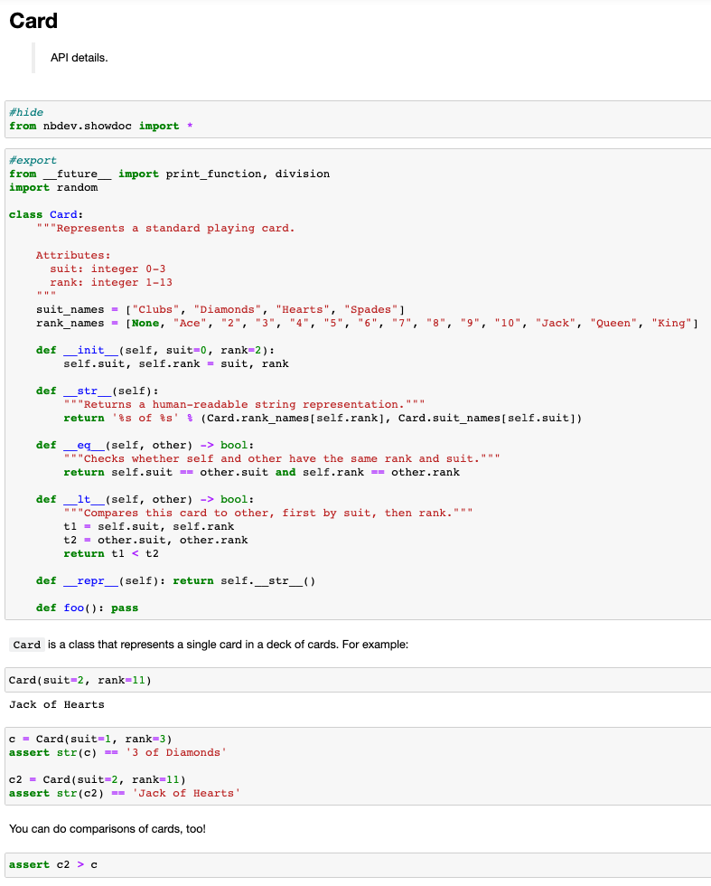

# Welcome to nbdev
> Create delightful python projects using Jupyter Notebooks


`nbdev` is a library that allows you to develop a python library in [Jupyter Notebooks](https://jupyter.org/), putting all your code, tests and documentation in one place. That is: you now have a true [literate programming](https://en.wikipedia.org/wiki/Literate_programming) environment, as envisioned by Donald Knuth back in 1983!

`nbdev` makes debugging and refactoring your code much easier relative to traditional programming environments. Furthermore, using nbdev promotes software engineering best practices because tests and documentation are first class citizens.

The developers use this regularly on macOS and Linux. We have not tested it on Windows and not all features may work correctly.

## Features of Nbdev

`nbdev` provides the following tools for developers:

- **Automatically generate docs** from Jupyter notebooks.  These docs are searchable and automatically hyperlinked to appropriate documentation pages by introspecting keywords you surround in backticks.
- Utilities to **automate the publishing of pypi and conda packages** including version number management.
- A robust, **two-way sync between notebooks and source code**, which allow you to use your IDE for code navigation or quick edits if desired.
- **Fine-grained control on hiding/showing cells**: you can choose to hide entire cells, just the output, or just the input.  Furthermore, you can embed cells in collapsible elements that are open or closed by default.
- Ability to **write tests directly in notebooks** without having to learn special APIs.  These tests get executed in parallel with a single CLI command.  You can even define certain groups of tests such that you don't have to always run long-running tests. 
- Tools for **merge/conflict resolution** with notebooks in a **human readable format**.
- **Continuous integration (CI) comes setup for you with [GitHub Actions](https://github.com/features/actions)** out of the box, that will run tests automatically for you.  Even if you are not familiar with CI or GitHub Actions, this starts working right away for you without any manual intervention.
- **Integration With GitHub Pages for docs hosting**: nbdev allows you to easily host your documentation for free, using GitHub pages.
- Create Python modules, following **best practices such as automatically defining `__all__`** ([more details](http://xion.io/post/code/python-all-wild-imports.html)) with your exported functions, classes, and variables.
- **Math equation support** with LaTeX.
- ... and much more!  See the [Getting Started](https://nbdev.fast.ai/#Getting-Started) section below for more information.

## A Motivating Example

For example, lets define a class that represents a playing card, with associated docs and tests in a Jupyter Notebook:



In the above screenshot, we have code, tests and documentation in one context! `nbdev` renders this into searchable docs (which are optionally hosted for free on GitHub Pages).  Below is an annotated screenshot of the generated docs for further explanation:


The above illustration is a subset of [this nbdev tutorial with a minimal example](https://nbdev.fast.ai/example.html), which uses code from [Think Python 2](https://github.com/AllenDowney/ThinkPython2) by Allen Downey.

### Explanation of annotations:

1. The heading **Card** corresponds to the first `H1` heading in a notebook with a note block _API Details_ as the summary.
2. `nbdev` automatically renders a Table of Contents for you.
3. `nbdev` automatically renders the signature of your class or function as a heading.  
4.  The cells where your code is defined will be hidden and replaced by standardized documentation of your function, showing its name, arguments, docstring, and link to the source code on github.
5. This part of docs is rendered automatically from the docstring.
6. The rest of the notebook is rendered as usual.  You can hide entire cells, hide only cell input or hide only output by using the [flags described on this page](https://nbdev.fast.ai/export2html.html).
7.  nbdev supports special block quotes that render as colored boxes in the documentation.  You can read more about them [here](https://nbdev.fast.ai/export2html.html#add_jekyll_notes).  In this specific example, we are using the `Note` block quote. 
8. Words you surround in backticks will be automatically hyperlinked to the associated documentation where appropriate. This is a trivial case where `Card` class is defined immediately above, however this works across pages and modules.  We will see another example of this in later steps.

## Installing

nbdev is on PyPI and conda so you can just run `pip install nbdev` or `conda install -c fastai nbdev`.

For an [editable install](https://stackoverflow.com/questions/35064426/when-would-the-e-editable-option-be-useful-with-pip-install), use the following:
```
git clone https://github.com/fastai/nbdev
pip install -e nbdev
```

nbdev is tested to work on Ubuntu, Macos and Windows, for the versions tagged with the `-latest` suffix in [these docs](https://docs.github.com/en/actions/reference/specifications-for-github-hosted-runners#supported-runners-and-hardware-resources).  

_Note that `nbdev` must be installed into the same python environment that you use for both your Jupyter Server and your workspace._

## Getting Started

The following are helpful resources for getting started with nbdev:

- The [tutorial](https://nbdev.fast.ai/tutorial.html).
- A [minimal, end-to-end example](https://nbdev.fast.ai/example.html) of using nbdev.  We suggest replicating this example after reading through the tutorial to solidify your understanding.
- The [docs](https://nbdev.fast.ai/).
- [release notes](https://github.com/fastai/nbdev/blob/master/CHANGELOG.md).


## If Someone Tells You Should Not Use Notebooks For Software Development

[Watch this video](https://youtu.be/9Q6sLbz37gk).

## Contributing

If you want to contribute to `nbdev`, be sure to review the [contributions guidelines](https://github.com/fastai/nbdev/blob/master/CONTRIBUTING.md). This project adheres to fastai`s [code of conduct](https://github.com/fastai/nbdev/blob/master/CODE-OF-CONDUCT.md). By participating, you are expected to uphold this code. In general, the fastai project strives to abide by generally accepted best practices in open-source software development.

Make sure you have the git hooks we use installed by running
```
nbdev_install_git_hooks
```
in the cloned repository folder. 

## Copyright

Copyright 2019 onwards, fast.ai, Inc. Licensed under the Apache License, Version 2.0 (the "License"); you may not use this project's files except in compliance with the License. A copy of the License is provided in the LICENSE file in this repository.

## Appendix

### nbdev and fastai

`nbdev` has been used to build innovative software used by many developers, such as [fastai](https://docs.fast.ai/), a deep learning library which implements a [unique layered api and callback system](https://arxiv.org/abs/2002.04688), and [fastcore](https://fastcore.fast.ai/), an extension to the Python programming language. Furthermore, `nbdev` allows a very small number of developers to maintain and grow a [large ecosystem](https://github.com/fastai) of software engineering, data science, machine learning and devops tools.

Here, for instance, is how `combined_cos` is defined and documented in the `fastai` library:


