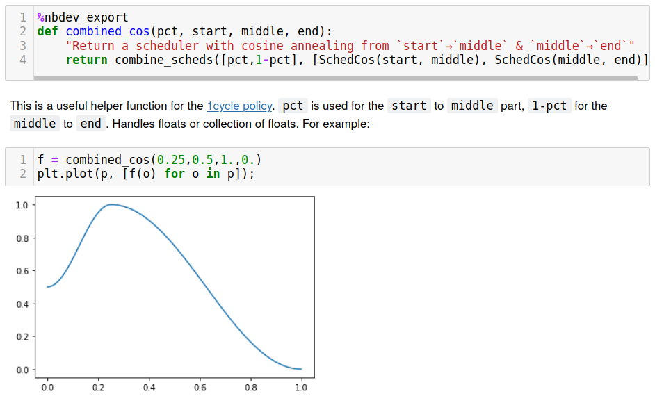
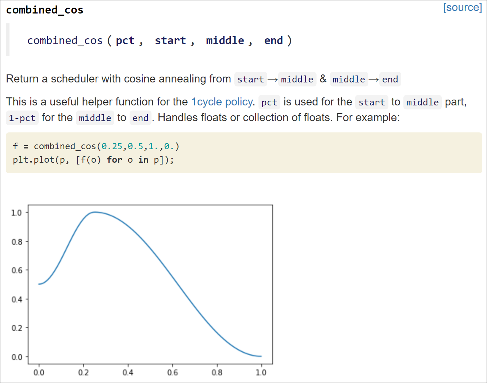

# Welcome to nbdev
> Create delightful python projects using Jupyter Notebooks


`nbdev` is a library that allows you to fully develop a library in [Jupyter Notebooks](https://jupyter.org/), putting all your code, tests and documentation in one place. That is: you now have a true [literate programming](https://en.wikipedia.org/wiki/Literate_programming) environment, as envisioned by Donald Knuth back in 1983!

Using the interactive environment, you can easily debug and refactor your code. Add `#export` to the cells that define the functions you want to include in your python modules. Here, for instance, is how `combined_cos` is defined and documented in the `fastai` library:



Using notebooks written like this, `nbdev` can create and run any of the following with a single command:

- Searchable, hyperlinked documentation; any word you surround in backticks will be *automatically* hyperlinked to the appropriate documentation
- Python modules, following best practices such as automatically defining `__all__` ([more details](http://xion.io/post/code/python-all-wild-imports.html)) with your exported functions, classes, and variables
- Pip and conda installers (uploaded to pypi and anaconda for you)
- Tests (defined directly in your notebooks, and run in parallel)
- Navigate and edit your code in a standard text editor or IDE, and export any changes automatically back into your notebooks

Since you are in a notebook, you can also add charts, text, links, images, videos, etc, that will included automatically in the documentation of your library. The cells where your code is defined will be hidden and replaced by standardized documentation of your function, showing its name, arguments, docstring, and link to the source code on github. For instance, the cells above are converted to:



See below for *Installing* and *Getting Started*. In the other pages of the documentation, you can get more details about:

- the [export](http://nbdev.fast.ai/export) functionality from jupyter notebooks to a python library
- the [cli](http://nbdev.fast.ai/cli) commands you can use with nbdev in a terminal
- how [export2html](http://nbdev.fast.ai/export2html) builds a documentation for your library
- how [sync](http://nbdev.fast.ai/sync) can allow you to export back from the python modules to the jupyter notebook
- how to put [tests](http://nbdev.fast.ai/test) in your notebooks, which can be run in parallel, and exported to CI from your notebooks
- get more info about the [additional functionality](http://nbdev.fast.ai/#Additional-functionality)
- [release notes](https://github.com/fastai/nbdev/blob/master/CHANGELOG.md)

## Installing

nbdev is on PyPI and conda so you can just run `pip install nbdev` or `conda install -c fastai nbdev`.

For an [editable install](https://stackoverflow.com/questions/35064426/when-would-the-e-editable-option-be-useful-with-pip-install), use the following:
```
git clone https://github.com/fastai/nbdev
pip install -e nbdev
```

_Note that `nbdev` must be installed into the same python environment that you use for both your Jupyter Server and your workspace._

## Getting Started

To begin your own project: 

- click [here](https://github.com/fastai/nbdev_template/generate) for GitHub (you need to be logged in to GitHub for this link to work).
- click [here](https://gitlab.com/thomas.capelle/nbdev_template/) for GitLab (you need to be logged in to GitLab for this link to work). 

Fill in the requested info and click *Create repository from template*, and a new GitHub or GitLab repo will be created for you.

**NB:** The name of your project will become the name of the Python package generated by nbdev. For that reason, it is a good idea to pick a short, all-lowercase name with _no dashes_ between words (underscores are allowed).

Now, open your terminal, and clone the repo you just created.

Alternatively, you can use a cli command `nbdev_new` to create a new nbdev project and initialize a git repository locally without creating a github repo.

Next, edit the `settings.ini` file. Note that it contains all the necessary information for when you'll be ready to package your library, so you shouldn't need to change the `setup.py` file provided by the template. The basic structure (that can be personalized provided you change the relevant information in `settings.ini`) is that the root of the repo will contain your notebooks, along with a folder `docs` where the doc will be auto-generated that contains everything for a [jekyll](https://jekyllrb.com/)-powered website. Because [GitHub Pages supports Jekyll](https://help.github.com/en/github/working-with-github-pages/setting-up-a-github-pages-site-with-jekyll), you can host your site for free on GitHub without any additional setup.

Your `settings.ini` is where all parts of nbdev look for any required configuration information. Once you've edited it, run the command `nbdev_build_lib` (which is automatically installed for you when you install `nbdev`. You'll now find that you have a new directory, with the name of whatever you set `lib_name` to in `settings.ini`.

Now, run `jupyter notebook`, and click `00_core.ipynb`. This is where you'll create your first module! Create Jupyter cells as you would in any notebook. For any cells that you want to be included in your python module, type `#export` as the first line of the cell. Note that for any new .ipynb that you create, you will also need to type `#default_exp target_module_name`, which will define the name of the generated module (lib_name/target_module_name.py).

In the last cell of your notebook, you can then run:

```python
from nbdev.export import *
notebook2script()
```

```
from nbdev.export import *
notebook2script()
```

    Converted 00_export.ipynb.
    Converted 01_sync.ipynb.
    Converted 02_showdoc.ipynb.
    Converted 03_export2html.ipynb.
    Converted 04_test.ipynb.
    Converted 05_merge.ipynb.
    Converted 05a_conda.ipynb.
    Converted 06_cli.ipynb.
    Converted 07_clean.ipynb.
    Converted 99_search.ipynb.
    Converted index.ipynb.
    Converted magic_flags.ipynb.
    Converted nbdev_callbacks.ipynb.
    Converted tutorial.ipynb.


Or in the command line, you can run:
``` bash
nbdev_build_lib
```
as long as you are somewhere in the folder where you are developing your library. Either of these will do the same thing: update your module to include all exported cells in your notebook.

To enable documentation in your GitHub repo, click 'Settings' on the main repo page, scroll down to 'GitHub Pages', and under 'Source' choose 'master branch /docs folder'. GitHub will then show you a link to your working documentation site.

Finally, edit `index.ipynb`. This will be converted into your projects *README* file, and will also be the index for your documentation (the page you're reading right now actually comes from an `index.ipynb` file!) You can use the module you just exported in this library, which means you can show real working code, and actual outputs. Once you have everything as you want it, run `nbdev_build_docs` in the terminal. This will export HTML versions of your notebooks to the `docs` directory, and will create hyperlinks for any words in backticks (as long as they exist in your module). It will also create a menu for all notebooks you have created, and a table of contents for each.

#### Note if using a subdirectory to contain .ipynb files instead of the project root

If you have set the parameter nbs_path to be anything other than the project root, you will not be able to import your generated modules without an extra step: 
- either install these modules locally, as their relative import will take you beyond the top-level package, which can be done by running `pip install -e .` in the project root, to install the modules to your environment in editable mode.
- or make a simlink in your notebook folder to the library folder, which can be done by running `ln -s lib_path lib_name` (adjust `lib_path` and `lib_name` to your use case).

## Additional functionality

There's a lot of functionality in `nbdev`; see the docs for each module in the sidebar to learn about all the features. Here we'll briefly highlight a couple.

### Adding your project to pypi and conda

If you want people to be able to install your project by just typing `pip install your-project` then you need to upload it to [pypi](https://pypi.org/). The good news is, we've already created a fully pypi compliant installer for your project! So all you need to do is register at pypi, if you haven't previously done so, and then create a file called `~/.pypirc` with your login details. It should have these contents:

```
[pypi]
username = your_pypi_username
password = your_pypi_password
```

Another thing you will need is `twine`, so you should run once
``` 
pip install twine
```

To upload your project to pypi, just type `make pypi` in your project root directory. Once it's complete, a link to your project on pypi will be printed.

To also upload your project to anaconda, [create an account](https://docs.anaconda.com/anaconda-repository/user-guide/tasks/create-account/) and then type `anaconda login` at your terminal. The use `make release` instead of `make pypi` - that will create and upload the pypi and conda packages and will also increment your version number.

**NB**: make sure you increment the version number in `settings.ini` each time you want to push a new release to pypi. If you call `make release` that will be done for you.

### Avoiding and handling git conflicts

Jupyter Notebooks can cause challenges with git conflicts, but life becomes much easier when you use `nbdev`. As a first step, run `nbdev_install_git_hooks` in the terminal from your project folder. This will set up git hooks which will remove metadata from your notebooks when you commit, greatly reducing the chance you have a conflict.

But if you do get a conflict, simply run `nbdev_fix_merge filename.ipynb`. This will replace any conflicts in cell outputs with your version, and if there are conflicts in input cells, then both cells will be included in the merged file, along with standard conflict markers (e.g. `=====`). Then you can open the notebook in Jupyter and choose which version to keep.

### Using nbdev as part of your CI

You can use [GitHub actions](https://github.com/features/actions) to leverage the functionality of nbdev and easily make a CI that:
- check the notebooks are readable (with `nbdev_read_nbs`)
- check the notebooks have been cleaned of needless metadata to avoid merge conflicts (with `nbdev_clean_nbs`)
- check there is no diff between the notebooks and the exported library (with `nbdev_diff_nbs`)
- run the tests in your notebooks (with `nbdev_test_nbs`)

The template contains a basic CI that uses the four points above, edit the file `.github/workflows/main.yml` to your liking and comment out the parts you don't want.

### Math equation support

nbdev supports equations (we use the excellent [KaTeX library](https://katex.org/)). Enable it with `use_math: true` in your `_config.yml` (it's enabled by default). You can include math in your notebook's documentation using the following methods.

Using `$$`, e.g.:

```

$$\sum_{i=1}^{k+1}i$$

```

Which is rendered as:

> $$\sum_{i=1}^{k+1}i$$

Using `$`, e.g.:

```
This version is displayed inline: $\sum_{i=1}^{k+1}i$ . You can include text before and after.
```

Which is rendered as:

> This version is displayed inline:$\sum_{i=1}^{k+1}i$ . You can include text before and after.

### Custom search engine

For adding search to your docs site, nbdev supports [Google Custom Search](https://cse.google.com/cse/all), including auto-completion as you type your search query. You can try it out by using the search box at the top of this page.

Although we can't fully automate the creation of the search engine (since you need to login to Google to do it) we have made it very easy. Here are the steps you need to follow: [Setting up search](https://nbdev.fast.ai/search).

### Google Colab Badges

Because both the documentation and code for nbdev is written in notebooks, you can optionally view and run nbdev documentation in [Google Colab](https://colab.research.google.com/). You can enable Google Colab badges that link to the appropriate notebook(s) in your GitHub repository.  

You can toggle this feature on or off in your `/_config.yml` file:

```yaml
# This specifies what badges are turned on by default for notebook docs.
default_badges:
  colab: true
```

Furthermore, if you want to hide a badge on an individual document but still show badges elsewhere, you can set the front matter `hide_colab_badge: true`.  For example, if you wanted to hide the Colab badge from showing up on the notebook `nbs/06_cli.ipynb`, your front matter (in the form of a markdown cell at the top of the notebook) will look like this:

```
# Command line functions
> Console commands added by the nbdev library

- hide_colab_badge:true
```

Note how in the above example, the title `Command line functions` is formatted as a markdown heading and the summary `Console commands added by the nbdev library` is formatted as a markdown block quote. The additional option `hide_colab_badge` is a list item.  It is important that this list item is separated from the summary by 2 newlines as shown above, in the same notebook markdown cell.

## Contributing

If you want to contribute to `nbdev`, be sure to review the [contributions guidelines](https://github.com/fastai/nbdev/blob/master/CONTRIBUTING.md). This project adheres to fastai`s [code of conduct](https://github.com/fastai/nbdev/blob/master/CODE-OF-CONDUCT.md). By participating, you are expected to uphold this code. In general, the fastai project strives to abide by generally accepted best practices in open-source software development.

Make sure you have the git hooks we use installed by running
```
nbdev_install_git_hooks
```
in the cloned repository folder. 

## Copyright

Copyright 2019 onwards, fast.ai, Inc. Licensed under the Apache License, Version 2.0 (the "License"); you may not use this project's files except in compliance with the License. A copy of the License is provided in the LICENSE file in this repository.

