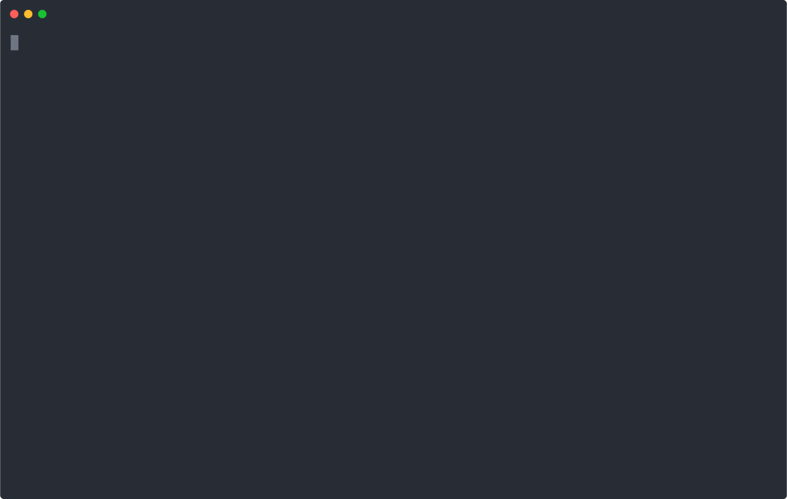

# release


<!-- WARNING: THIS FILE WAS AUTOGENERATED! DO NOT EDIT! -->

## Overview

`nbdev.release` provides 3 commands that you can run from your shell to
manage your changelog file and git releases:

- `nbdev_changelog`: creates a CHANGELOG.md file from closed and labeled
  GitHub issues
- `nbdev_release_git`: tags and creates a release in GitHub for the
  current version
- `nbdev_release_gh`: calls `nbdev_changelog`, lets you edit the result,
  then pushes to git and calls `nbdev_release_git`

It provides 3 futher commands for releasing packages on pypi or conda:

- `nbdev_pypi`: Create and upload a pypi installer
- `nbdev_conda`: Create and upload a conda installer
- `nbdev_release_both`: Create and upload both pypi and conda installers

Here’s a brief demonstration of how to use the changelog and git release
tools in `nbdev.release`. This demo first creates an issue using the
[`gh`](https://cli.github.com/) command line tool, and then closes it
using `git`; you can also use GitHub’s web interface for both of these
tasks. (Note that this functionality used to be in a project called
`fastrelease`, so in the video the command line tools have different
names, starting with `fastrelease_` instead of `nbdev_`).

[](images/release.svg)

### Setup

You’ll need to get a GitHub [personal access
token](https://docs.github.com/en/github/authenticating-to-github/creating-a-personal-access-token)
if you haven’t already. To do so, [click
here](https://github.com/settings/tokens/new) and enter “nbdev” in the
“Note” section, and click the `repo` checkbox.

Then click “Generate Token” at the bottom of the screen, and copy the
token (the long string of letters and numbers shown). You can easily do
that by clicking the little clipboard icon next to the token.


It’s easiest to save the token as an environment variable `GITHUB_TOKEN`
that can be automatically accessed. We recommend you do this is by
adding the following to the end of your `.bashrc` or `.zshrc` file:

``` bash
export GITHUB_TOKEN=xxx
```

…and then replace the `xxx` with the token you just copied. It will
automatically be avaialble whenever you start a new shell (but don’t
forget to `source` that file or open a new shell after you change it.).

### Creating release notes

Now you’re ready to create your release notes. These are created in a
file called `CHANGELOG.md`. Here’s an example of what it creates: [nbdev
CHANGELOG](https://github.com/fastai/nbdev/blob/master/CHANGELOG.md).

All issues with the label **bug**, **enhancement**, or **breaking** that
have been closed in your repo since your last release will be added to
the top of this file. If you haven’t made any releases before, then all
issues with those labels will be included.

Therefore, before you create or update `CHANGELOG.md`, go to your GitHub
issues page, remove `is:open` from the filter, and label any issues you
want included with one of the labels above. When you’ve done that, you
can create or update your release notes by running in your terminal:

    nbdev_changelog

The titles and bodies of each issue will be added. Open `CHANGELOG.md`
in your editor and make any edits that you want, and then commit the
file to your repo (remember to `git add` it!)

### Tagging a release

You should now tag a release. This will create a tag in GitHub with your
current version number in `settings.ini`, and will then make it into a
release, using your latest release notes as the description of the
release:

    nbdev_release_git

After you run this, be sure to increment your version number in
`settings.ini`. You can either edit it manually, or if you use nbdev it
can be done for you by running:

    nbdev_bump_version

### Doing both (creating release notes, and tagging a release)

To complete both of the steps above, run:

    nbdev_release_gh

See the screencast above for a demonstration of this.

## Python API

------------------------------------------------------------------------

<a
href="https://github.com/fastai/nbdev/blob/master/nbdev/release.py#L46"
target="_blank" style="float:right; font-size:smaller">source</a>

### Release

>  Release (owner=None, repo=None, token=None, **groups)

*Create CHANGELOG.md from GitHub issues*

To create a markdown changelog, first create a
[`Release`](https://nbdev.fast.ai/api/release.html#release) object,
optionally passing a mapping from GitHub labels to markdown titles. Put
your github token in a file named `token` at the root of your repo.
[`Release`](https://nbdev.fast.ai/api/release.html#release) attempts to
fetch values for arguments from the following locations if not supplied:

- **owner:** fetched from the field `user` in `settings.ini`. This is
  the owner name of the repository on GitHub. For example for the repo
  `fastai/fastcore` the owner would be `fastai`.
- **repo:** fetched from the field `lib_name` in `settings.ini`. This is
  the name of the repository on GitHub. For example for the repo
  `fastai/fastcore` the owner would be `fastcore`.
- **token:** fetched from a file named `token` at the root of your repo.
  Creating a token is discussed in [the
  setup](https://fastrelease.fast.ai/#Set-up) section.
- **groups:** (optional) fetched from the field `label_groups` in
  `settings.ini`, which is a JSON string. This is a mapping from label
  names to titles in your release notes. If not specified, this defaults
  to:

``` python
{"breaking": "Breaking Changes", "enhancement":"New Features", "bug":"Bugs Squashed"}
```

------------------------------------------------------------------------

<a
href="https://github.com/fastai/nbdev/blob/master/nbdev/release.py#L69"
target="_blank" style="float:right; font-size:smaller">source</a>

### Release.changelog

>  Release.changelog (debug=False)

*Create the CHANGELOG.md file, or return the proposed text if `debug` is
`True`*

<table>
<colgroup>
<col style="width: 6%" />
<col style="width: 25%" />
<col style="width: 34%" />
<col style="width: 34%" />
</colgroup>
<thead>
<tr>
<th></th>
<th><strong>Type</strong></th>
<th><strong>Default</strong></th>
<th><strong>Details</strong></th>
</tr>
</thead>
<tbody>
<tr>
<td>debug</td>
<td>bool</td>
<td>False</td>
<td>Just print the latest changes, instead of updating file</td>
</tr>
</tbody>
</table>

``` python
rel = Release()
# print(rel.changelog(debug=True))
```

------------------------------------------------------------------------

<a
href="https://github.com/fastai/nbdev/blob/master/nbdev/release.py#L87"
target="_blank" style="float:right; font-size:smaller">source</a>

### Release.release

>  Release.release ()

*Tag and create a release in GitHub for the current version*

This uses the version information from your `settings.ini`.

------------------------------------------------------------------------

<a
href="https://github.com/fastai/nbdev/blob/master/nbdev/release.py#L96"
target="_blank" style="float:right; font-size:smaller">source</a>

### Release.latest_notes

>  Release.latest_notes ()

*Latest CHANGELOG entry*

All relevant pull requests and issues are fetched from the GitHub API,
and are categorized according to a user-supplied mapping from labels to
markdown headings.

## CLI functions

------------------------------------------------------------------------

<a
href="https://github.com/fastai/nbdev/blob/master/nbdev/release.py#L105"
target="_blank" style="float:right; font-size:smaller">source</a>

### changelog

>  changelog (debug:<function store_true>=False, repo:str=None)

*Create a CHANGELOG.md file from closed and labeled GitHub issues*

<table>
<colgroup>
<col style="width: 6%" />
<col style="width: 25%" />
<col style="width: 34%" />
<col style="width: 34%" />
</colgroup>
<thead>
<tr>
<th></th>
<th><strong>Type</strong></th>
<th><strong>Default</strong></th>
<th><strong>Details</strong></th>
</tr>
</thead>
<tbody>
<tr>
<td>debug</td>
<td>store_true</td>
<td>False</td>
<td>Print info to be added to CHANGELOG, instead of updating file</td>
</tr>
<tr>
<td>repo</td>
<td>str</td>
<td>None</td>
<td>repo to use instead of <code>lib_name</code> from
<code>settings.ini</code></td>
</tr>
</tbody>
</table>

------------------------------------------------------------------------

<a
href="https://github.com/fastai/nbdev/blob/master/nbdev/release.py#L115"
target="_blank" style="float:right; font-size:smaller">source</a>

### release_git

>  release_git (token:str=None)

*Tag and create a release in GitHub for the current version*

<table>
<colgroup>
<col style="width: 6%" />
<col style="width: 25%" />
<col style="width: 34%" />
<col style="width: 34%" />
</colgroup>
<thead>
<tr>
<th></th>
<th><strong>Type</strong></th>
<th><strong>Default</strong></th>
<th><strong>Details</strong></th>
</tr>
</thead>
<tbody>
<tr>
<td>token</td>
<td>str</td>
<td>None</td>
<td>Optional GitHub token (otherwise <code>token</code> file is
used)</td>
</tr>
</tbody>
</table>

------------------------------------------------------------------------

<a
href="https://github.com/fastai/nbdev/blob/master/nbdev/release.py#L124"
target="_blank" style="float:right; font-size:smaller">source</a>

### release_gh

>  release_gh (token:str=None)

*Calls `nbdev_changelog`, lets you edit the result, then pushes to git
and calls `nbdev_release_git`*

<table>
<colgroup>
<col style="width: 6%" />
<col style="width: 25%" />
<col style="width: 34%" />
<col style="width: 34%" />
</colgroup>
<thead>
<tr>
<th></th>
<th><strong>Type</strong></th>
<th><strong>Default</strong></th>
<th><strong>Details</strong></th>
</tr>
</thead>
<tbody>
<tr>
<td>token</td>
<td>str</td>
<td>None</td>
<td>Optional GitHub token (otherwise <code>token</code> file is
used)</td>
</tr>
</tbody>
</table>

## Publish Packages

------------------------------------------------------------------------

<a
href="https://github.com/fastai/nbdev/blob/master/nbdev/release.py#L150"
target="_blank" style="float:right; font-size:smaller">source</a>

### pypi_json

>  pypi_json (s)

*Dictionary decoded JSON for PYPI path `s`*

------------------------------------------------------------------------

<a
href="https://github.com/fastai/nbdev/blob/master/nbdev/release.py#L155"
target="_blank" style="float:right; font-size:smaller">source</a>

### latest_pypi

>  latest_pypi (name)

*Latest version of `name` on pypi*

------------------------------------------------------------------------

<a
href="https://github.com/fastai/nbdev/blob/master/nbdev/release.py#L161"
target="_blank" style="float:right; font-size:smaller">source</a>

### pypi_details

>  pypi_details (name)

*Version, URL, and SHA256 for `name` from pypi*

------------------------------------------------------------------------

<a
href="https://github.com/fastai/nbdev/blob/master/nbdev/release.py#L183"
target="_blank" style="float:right; font-size:smaller">source</a>

### conda_output_path

>  conda_output_path (name, build='build')

*Output path for conda build*

------------------------------------------------------------------------

<a
href="https://github.com/fastai/nbdev/blob/master/nbdev/release.py#L240"
target="_blank" style="float:right; font-size:smaller">source</a>

### write_conda_meta

>  write_conda_meta (path='conda')

*Writes a `meta.yaml` file to the `conda` directory of the current
directory*

This function is used in the `conda_package` CLI command.

**NB**: you need to first of all upload your package to PyPi, before
creating the conda package.

------------------------------------------------------------------------

<a
href="https://github.com/fastai/nbdev/blob/master/nbdev/release.py#L246"
target="_blank" style="float:right; font-size:smaller">source</a>

### write_requirements

>  write_requirements (path:str='')

*Writes a `requirements.txt` file to `directory` based on settings.ini.*

This function can be used in situations where you need to generate a
`requirements.txt` file for a project.

------------------------------------------------------------------------

<a
href="https://github.com/fastai/nbdev/blob/master/nbdev/release.py#L254"
target="_blank" style="float:right; font-size:smaller">source</a>

### anaconda_upload

>  anaconda_upload (name, loc=None, user=None, token=None, env_token=None)

*Upload `name` to anaconda*

``` python
from fastcore.xtras import globtastic
```

------------------------------------------------------------------------

<a
href="https://github.com/fastai/nbdev/blob/master/nbdev/release.py#L265"
target="_blank" style="float:right; font-size:smaller">source</a>

### release_conda

>  release_conda (path:str='conda', do_build:<function bool_arg>=True,
>                     build_args:str='', skip_upload:<function
>                     store_true>=False, mambabuild:<function store_true>=False,
>                     upload_user:str=None)

*Create a `meta.yaml` file ready to be built into a package, and
optionally build and upload it*

<table>
<colgroup>
<col style="width: 6%" />
<col style="width: 25%" />
<col style="width: 34%" />
<col style="width: 34%" />
</colgroup>
<thead>
<tr>
<th></th>
<th><strong>Type</strong></th>
<th><strong>Default</strong></th>
<th><strong>Details</strong></th>
</tr>
</thead>
<tbody>
<tr>
<td>path</td>
<td>str</td>
<td>conda</td>
<td>Path where package will be created</td>
</tr>
<tr>
<td>do_build</td>
<td>bool_arg</td>
<td>True</td>
<td>Run <code>conda build</code> step</td>
</tr>
<tr>
<td>build_args</td>
<td>str</td>
<td></td>
<td>Additional args (as str) to send to <code>conda build</code></td>
</tr>
<tr>
<td>skip_upload</td>
<td>store_true</td>
<td>False</td>
<td>Skip <code>anaconda upload</code> step</td>
</tr>
<tr>
<td>mambabuild</td>
<td>store_true</td>
<td>False</td>
<td>Use <code>mambabuild</code> (requires <code>boa</code>)</td>
</tr>
<tr>
<td>upload_user</td>
<td>str</td>
<td>None</td>
<td>Optional user to upload package to</td>
</tr>
</tbody>
</table>

------------------------------------------------------------------------

<a
href="https://github.com/fastai/nbdev/blob/master/nbdev/release.py#L295"
target="_blank" style="float:right; font-size:smaller">source</a>

### chk_conda_rel

>  chk_conda_rel (nm:str, apkg:str=None, channel:str='fastai',
>                     force:<function store_true>=False)

*Prints GitHub tag only if a newer release exists on Pypi compared to an
Anaconda Repo.*

<table>
<thead>
<tr>
<th></th>
<th><strong>Type</strong></th>
<th><strong>Default</strong></th>
<th><strong>Details</strong></th>
</tr>
</thead>
<tbody>
<tr>
<td>nm</td>
<td>str</td>
<td></td>
<td>Package name on pypi</td>
</tr>
<tr>
<td>apkg</td>
<td>str</td>
<td>None</td>
<td>Anaconda Package (defaults to {nm})</td>
</tr>
<tr>
<td>channel</td>
<td>str</td>
<td>fastai</td>
<td>Anaconda Channel</td>
</tr>
<tr>
<td>force</td>
<td>store_true</td>
<td>False</td>
<td>Always return github tag</td>
</tr>
</tbody>
</table>

To build and upload a conda package, cd to the root of your repo, and
then:

    nbdev_conda_package

Or to do things more manually:

    nbdev_conda_package --do_build false
    cd conda
    conda build --no-anaconda-upload --output-folder build {name}
    anaconda upload build/noarch/{name}-{ver}-*.tar.bz2

Add `--debug` to the `conda build command` to debug any problems that
occur. Note that the build step takes a few minutes. Add `-u {org_name}`
to the `anaconda upload` command if you wish to upload to an
organization, or pass `upload_user` to `nbdev_conda_package`.

**NB**: you need to first of all upload your package to PyPi, before
creating the conda package.

------------------------------------------------------------------------

<a
href="https://github.com/fastai/nbdev/blob/master/nbdev/release.py#L310"
target="_blank" style="float:right; font-size:smaller">source</a>

### release_pypi

>  release_pypi (repository:str='pypi')

*Create and upload Python package to PyPI*

<table>
<colgroup>
<col style="width: 6%" />
<col style="width: 25%" />
<col style="width: 34%" />
<col style="width: 34%" />
</colgroup>
<thead>
<tr>
<th></th>
<th><strong>Type</strong></th>
<th><strong>Default</strong></th>
<th><strong>Details</strong></th>
</tr>
</thead>
<tbody>
<tr>
<td>repository</td>
<td>str</td>
<td>pypi</td>
<td>Respository to upload to (defined in ~/.pypirc)</td>
</tr>
</tbody>
</table>

Use `--repository` flag to upload to [TestPypi](https://test.pypi.org/)
(e.g. `nbdev_pypi --repository testpypi`) and custom/private
repositories.

The
[~/.pypirc](https://packaging.python.org/en/latest/specifications/pypirc/)
file can be updated to configure the additional repositories, see
example below:

``` toml
[distutils]
index-servers =
    pypi
    testpypi
    private-repository

[pypi]
username = __token__
password = <PyPI token>

[testpypi]
username = __token__
password = <TestPyPI token>

[private-repository]
repository = <private-repository URL>
username = <private-repository username>
password = <private-repository password>
```

Use `nbdev_pypi --repository private-repository` to upload to the
private repository.

------------------------------------------------------------------------

<a
href="https://github.com/fastai/nbdev/blob/master/nbdev/release.py#L320"
target="_blank" style="float:right; font-size:smaller">source</a>

### release_both

>  release_both (path:str='conda', do_build:<function bool_arg>=True,
>                    build_args:str='', skip_upload:<function store_true>=False,
>                    mambabuild:<function store_true>=False,
>                    upload_user:str=None, repository:str='pypi')

*Release both conda and PyPI packages*

<table>
<colgroup>
<col style="width: 6%" />
<col style="width: 25%" />
<col style="width: 34%" />
<col style="width: 34%" />
</colgroup>
<thead>
<tr>
<th></th>
<th><strong>Type</strong></th>
<th><strong>Default</strong></th>
<th><strong>Details</strong></th>
</tr>
</thead>
<tbody>
<tr>
<td>path</td>
<td>str</td>
<td>conda</td>
<td>Path where package will be created</td>
</tr>
<tr>
<td>do_build</td>
<td>bool_arg</td>
<td>True</td>
<td>Run <code>conda build</code> step</td>
</tr>
<tr>
<td>build_args</td>
<td>str</td>
<td></td>
<td>Additional args (as str) to send to <code>conda build</code></td>
</tr>
<tr>
<td>skip_upload</td>
<td>store_true</td>
<td>False</td>
<td>Skip <code>anaconda upload</code> step</td>
</tr>
<tr>
<td>mambabuild</td>
<td>store_true</td>
<td>False</td>
<td>Use <code>mambabuild</code> (requires <code>boa</code>)</td>
</tr>
<tr>
<td>upload_user</td>
<td>str</td>
<td>None</td>
<td>Optional user to upload package to</td>
</tr>
<tr>
<td>repository</td>
<td>str</td>
<td>pypi</td>
<td>Pypi respository to upload to (defined in ~/.pypirc)</td>
</tr>
</tbody>
</table>

## Bump Version

------------------------------------------------------------------------

<a
href="https://github.com/fastai/nbdev/blob/master/nbdev/release.py#L335"
target="_blank" style="float:right; font-size:smaller">source</a>

### bump_version

>  bump_version (version, part=2, unbump=False)

------------------------------------------------------------------------

<a
href="https://github.com/fastai/nbdev/blob/master/nbdev/release.py#L344"
target="_blank" style="float:right; font-size:smaller">source</a>

### nbdev_bump_version

>  nbdev_bump_version (part:int=2, unbump:bool=False)

*Increment version in settings.ini by one*

<table>
<thead>
<tr>
<th></th>
<th><strong>Type</strong></th>
<th><strong>Default</strong></th>
<th><strong>Details</strong></th>
</tr>
</thead>
<tbody>
<tr>
<td>part</td>
<td>int</td>
<td>2</td>
<td>Part of version to bump</td>
</tr>
<tr>
<td>unbump</td>
<td>bool</td>
<td>False</td>
<td>Reduce version instead of increasing it</td>
</tr>
</tbody>
</table>
