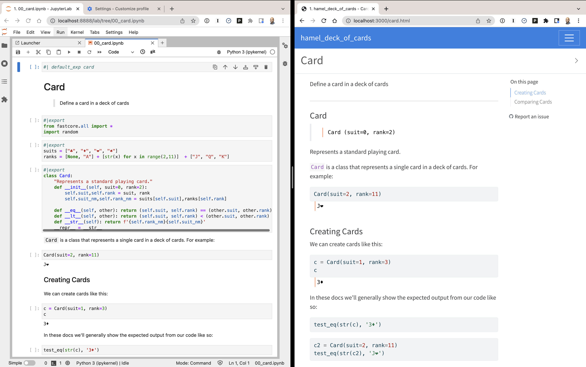
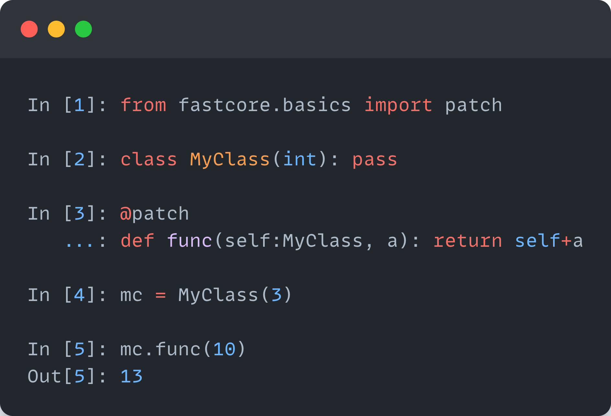

# nbdev+Quarto: A new secret weapon for productivity
Hamel Husain, Jeremy Howard
2022-07-28

*[Originally posted](https://www.fast.ai/2022/07/28/nbdev-v2/) on the
fast.ai blog*

<figure>

<figcaption aria-hidden="true">A single notebook can create a python
module, tests, CI, pypi/conda packages, and more.</figcaption>
</figure>

## Our new secret weapon for productivity

Today we’re excited to announce that we’ve teamed up with Quarto to give
[nbdev](https://nbdev.fast.ai) superpowers. nbdev offers Python
programmers a common set of tools for using Jupyter notebooks to:

- Write & distribute software packages
- Test code, and
- Author documentation and technical articles

Although notebooks are already widely used for once-off exploratory
work, it’s less well-known that they are perfectly capable of writing
quality software. In fact, we’ve used nbdev for a wide range of software
projects over the last three years, including [deep learning
libraries,](https://github.com/fastai/fastai) [API
clients](https://github.com/fastai/ghapi), [Python language
extensions](https://github.com/fastai/fastcore), [terminal user
interfaces](https://github.com/nat/ghtop), and more. We discovered that
it is not only capable of writing great software but that it **has also
increased our productivity by 300% or more**. With nbdev, developers
simply write notebooks with lightweight markup and get high-quality
documentation, tests, continuous integration, and packaging for free!
Nbdev has allowed us to maintain and scale many [open source
projects](https://github.com/fastai). Pull requests are often
accompanied by detailed documentation and tests–contributors simply
write notebooks.

This is why we’re excited to share nbdev v2. It’s rewritten from the
ground up, with much-anticipated features including:

- Interoperation with non-nbdev codebases for tasks like documentation
- Support for any static site generator
- Wide variety of output mediums such as blogs, papers, slides, and
  websites
- A faster Jupyter kernel, which also means faster tests
- Cleaner and more extensible API, which supports custom directives,
  custom module exporters, and more

## nbdev in industry

We have piloted nbdev at several companies. We were delighted to receive
the following feedback, which fits our own experience using and
developing nbdev:

## What’s nbdev?

Nbdev embraces the dynamic nature of python and REPL-driven development
in ways that traditional IDEs and software development workflows cannot.
We thoroughly discussed the motivation, history, and goals of nbdev in
this [initial launch
post](https://www.fast.ai/posts/2019-11-27-nbdev.html#software-development-tools)
three years ago. The creator of Jupyter, Fernando Pérez, told us:

> \[Nbdev\] should be celebrated and used a lot more - I have kept a tab
> with your original nbdev blog post open for months in Chrome because
> of how often I refer to it and point others to this work

In short, nbdev embraces ideas from [literate
programming](https://en.wikipedia.org/wiki/Literate_programming) and
[exploratory
programming](https://en.wikipedia.org/wiki/Exploratory_programming).
These paradigms have been revisited in platforms like XCode
[Playgrounds](https://en.wikipedia.org/wiki/Swift_Playgrounds) and
languages like Smalltalk, LISP, and Mathematica. With nbdev, we sought
to push these paradigms even further by enabling it for one of the most
popular dynamic programming languages in the world: Python.

<figure>

<figcaption aria-hidden="true">State of the Octoverse 2021,
GitHub</figcaption>
</figure>

Even though nbdev is most widely used in scientific computing
communities due to its integration with Jupyter Notebooks, we’ve found
that nbdev is well suited for a much wider range of software. We have
used nbdev to write [deep learning
libraries,](https://github.com/fastai/fastai) [API
clients](https://github.com/fastai/ghapi), [python language
extensions](https://github.com/fastai/fastcore), [terminal user
interfaces](https://github.com/nat/ghtop), and more!

*Hamel: When I use nbdev, my colleagues are often astounded by how
quickly I can create and distribute high-quality python packages. I
consider nbdev to be a superpower that allows me to create tests and
documentation without any additional friction, which makes all of my
projects more maintainable. I also find writing software with nbdev to
be more fun and productive as I can iterate very fast on ideas relative
to more traditional software engineering workflows. Lastly, with nbdev I
can also use traditional text-based IDEs if I want to, so I get the best
of both worlds.*

## What we learned after three years of using nbdev

While nbdev was originally developed to simplify the software
development workflow for various [fast.ai
projects](https://github.com/fastai), we found that users wanted to
extend nbdev to:

- Write and publish blog posts, books, papers, and other types of
  documents with Jupyter Notebooks
- Document existing codebases not written in nbdev
- Accommodate traditional Python conventions–for those constrained in
  how their code is organized and formatted
- Publish content using *any* static site generator

While we created projects such as
[fastpages](https://github.com/fastai/fastpages) and
[fastdoc](https://github.com/fastai/fastdoc) to accomplish some of these
tasks, we realized that it would be better to have a single set of
flexible tools to accomplish all of them. To this end, we were extremely
excited to discover [Quarto](https://quarto.org/), an open-source
technical publishing system built on pandoc.

*Hamel: The more I used nbdev for creating Python modules, the more I
wanted to use it for writing blogs and documenting existing codebases.
The ability to customize the way notebooks are rendered (hiding
vs. showing cells, stripping output, etc.), along with the facilities
for including unit tests, made it my go-to authoring tool for all
technical content. I’m excited that nbdev2 unlocks all of these
possibilities for everyone!*

## Enter Quarto: A pandoc super-processor

[Quarto](https://quarto.org/) is a project that enables technical
publishing with support for Jupyter Notebook, VSCode, Observable, and
plaintext editors. Furthermore, Quarto enables the publishing of
high-quality articles, reports, websites, and blogs in HTML, PDF, ePub,
PowerPoint slides, and more. Quarto is maintained by
[RStudio](https://www.rstudio.com/), a company with a long history of
products supporting literate programming, such as RMarkdown and RStudio.

Quarto is built on top of [Pandoc](https://pandoc.org/), a universal
document converter that supports nearly any format you can think of.
Pandoc achieves this seemingly magical feat by representing documents in
a common abstract syntax tree (AST) that serves as the medium through
which different formats can be translated. By extension, Quarto allows
you to generate content in almost any format you wish! You can use
[pandoc filters](https://pandoc.org/filters%202.html#summary) to modify
the AST and the output format, which allows you to use any static site
generator you want, and programmatically modify and generate content.

Quarto allows you to [compose pandoc filters in a processing
pipeline](https://quarto.org/docs/extensions/filters.html#activating-filters)
and apply them to specific documents or entire projects. You can also
[distribute filters as Quarto
extensions](https://quarto.org/docs/extensions/filters.html#distribution),
which makes Quarto extremely customizable.

We also find Quarto compelling because user interfaces such as [comment
directives](https://quarto.org/docs/reference/cells/cells-jupyter.html#overview)
(comments that start with `#|`) correlate with nbdev. In fact, we even
learned that nbdev inspired Quarto in this regard! In general, Quarto
and nbdev share many goals, and the Quarto team has been incredibly
responsive to our suggestions. For example, the ability to create
[notebook filters](https://quarto.org/docs/extensions/nbfilter.html) to
modify notebooks before rendering. Below is a screenshot of a Jupyter
notebook rendered with Quarto and nbdev.

<figure>

<figcaption aria-hidden="true">Quarto rendering a Jupyter notebook
written with nbdev</figcaption>
</figure>

Finally, Quarto supports more programming languages than just Python and
has been adding new features and fixing bugs at an impressive speed.
This gives us confidence that we will be able to expand nbdev to support
more use cases in the future. We discuss some of these future directions
in the closing section.

## A blazing fast notebook kernel: execnb

A core component of nbdev is executing and testing notebooks
programmatically. It is important that this notebook runner executes
with minimal overhead to maintain our goal of providing a delightful
developer experience. This is why we built
[execnb](https://github.com/fastai/execnb), a lightweight notebook
runner for Python kernels, which executes notebooks blazingly fast.
Furthermore, execnb allows parameterized execution of notebooks.

*Hamel: I have been an enthusiastic user of tools like papermill that
programmatically run notebooks for use-cases like [creating
dashboards](https://github.com/github/covid19-dashboard) or enabling
[new kinds of machine learning
workflows](https://outerbounds.com/blog/notebooks-in-production-with-metaflow).
I believe execnb unlocks even more possibilities with its ability to
inject arbitrary code at any place in a notebook, as well as the ability
to pass callbacks that run before and/or after cells are executed. This
opens up possibilities to create new types of workflows with notebooks
that I am excited about exploring in the near future.*

## Towards a dialect of python that embraces its dynamic nature

One way to understand nbdev is part of an ecosystem that is designed to
embrace Python’s dynamic properties for REPL-driven software
engineering. [Similar to
Clojure](https://clojure.org/guides/repl/enhancing_your_repl_workflow),
our goal is to provide tools that remove all friction from using the
REPL in your programming workflow. We believe that the REPL enhances
developer workflows thanks to context-sensitive auto-completion,
signature inspection, and documentation–all based on the actual state of
your code, and none of which are available in IDEs that depend solely on
static analysis. We have found that for this reason, nbdev, with its
Jupyter notebook foundation, makes programming significantly more
productive and enjoyable.

Our efforts to support REPL-driven development and literate programming
are not limited to nbdev. We maintain a number of libraries that extend
python to bolster this programming experience. The most notable of these
libraries is [fastcore](https://github.com/fastai/fastcore), which
extends Python in terms of
[testing](https://fastcore.fast.ai/test.html), [documenting
code](https://fastcore.fast.ai/docments.html),
[metaprogramming](https://fastcore.fast.ai/meta.html#Metaprogramming),
[attribute
helpers](https://fastcore.fast.ai/basics.html#Attribute-Helpers),
[enhanced representations of
objects](https://fastcore.fast.ai/basics.html#basic_repr), and
notebook-friendly
[patching](https://fastcore.fast.ai/basics.html#Patching). This [blog
post](https://fastpages.fast.ai/fastcore/) offers a gentle introduction
to fastcore. In addition to literate programming, fastcore encourages
conventions such as brevity and efficient use of vertical space so you
can accomplish more with significantly less code. For example, below is
a simple decorator that enables notebook-friendly
[patching](https://fastcore.fast.ai/basics.html#Patching):

<figure>

<figcaption aria-hidden="true"><code>@patch</code> decorator from
fastcore</figcaption>
</figure>

We believe that this combination of a new developer workflow (nbdev),
Python extensions (fastcore), and associated norms form a new dialect of
Python that is centered on leveraging its dynamic nature–in contrast to
an ever-growing trend toward [static
analysis](https://mypy.readthedocs.io/en/stable/). We suspect that this
dialect of Python will be more productive for programmers in many
scenarios. We are framing this ecosystem as a “dialect” as it is still
very much Python and is approachable by anyone who is familiar with the
language. Furthermore, despite nbdev’s notebook workflow, our tools
generate plaintext modules that can be navigated and edited with
text-based IDEs, allowing programmers to experience the best of both
worlds, if they desire.

*Hamel: I believe this framing of a Python dialect is key to properly
understanding what nbdev is. While it may be tempting to get stuck on
specific features or technical details of nbdev, it is useful to zoom
out to understand the overall intent of creating a better workflow
rather than conforming too rigidly to existing ones. A good analogy is
TypeScript’s relationship with JavaScript: it is an extension of an
existing programming language that supports a new way of programming. I
encourage you to treat nbdev in a similar fashion: be willing to try new
ways of programming and observe which tradeoffs resonate with you. At
the very least, I believe nbdev is a fun way to experience a different
way of writing software, which will broaden your horizons about
programming in general, all without having to learn an entirely new
programming language!*

## The future of nbdev

While we are excited about nbdev2, we believe we have only scratched the
surface of what’s possible. We are considering the following features:

- Supporting more languages beyond Python, such as Julia, R and
  JavaScript
- Offering interfaces for executing parameterized notebooks that mimic
  Python scripts
- Extensions for more static site generators and filters
- Supporting alternate testing backends, such as pytest
- Supporting a greater number of docstring formats, such as
  [Google-style](https://google.github.io/styleguide/pyguide.html#381-docstrings)
  docstrings
- More options to use plain-text or human readable notebook backends
  other than JSON

If you have interesting ideas about how nbdev can be extended, please
drop and chat with us on [discord](https://discord.com/invite/xnpeRdg)
or post a message in the [forums](https://forums.fast.ai/).

## How you can get started with nbdev

Our project’s website is at [nbdev.fast.ai](https://nbdev.fast.ai/),
where we will be posting tutorials, examples, and more documentation in
the coming days.

## Thank You

This new version of nbdev was a team effort by many wonderful people. We
want to highlight two people who have made outstanding contributions:

- [Wasim Lorgat](https://twitter.com/wasimlorgat) was instrumental
  across different areas, including significant contributions to
  fastcore, execnb, and nbdev, as well as the implementation of the new
  nbdev [home page](https://nbdev.fast.ai/). With Wasim’s help, we were
  able to push nbdev to a new level of functionality and quality.

- [JJ Allaire](https://en.wikipedia.org/wiki/Joseph_J._Allaire) is not
  only the CEO of RStudio but also the steward of Quarto. JJ was
  incredibly responsive and eager to work with us on nbdev and added
  many features to Quarto specifically with nbdev in mind, such as
  [notebook filters](https://quarto.org/docs/extensions/nbfilter.html).
  We were also astounded by the attention to detail and the pace at
  which bugs are addressed. This new version of nbdev would not have
  been possible without JJ’s help, and we are excited to continue to
  work with him.

We also want to thank the amazing fastai community, notably [Isaac
Flath](https://twitter.com/isaac_flath), [Benjamin
Warner](https://mobile.twitter.com/benjamin_warner) and [Zach
Mueller](https://twitter.com/TheZachMueller) for their tireless work on
this project.

## A conversation with JJ Allaire

To celebrate the launch of nbdev v2 and Quarto, Jeremy sat down with the
CEO of Posit (previously known as RStudio, the company behind Quarto),
JJ Allaire, to talk about software development, scientific publishing,
R, Python, literate programming, and much more.

<iframe width="560" height="315" src="https://www.youtube.com/embed/xxVVSxcjNQs" title="YouTube video player" frameborder="0" allow="accelerometer; autoplay; clipboard-write; encrypted-media; gyroscope; picture-in-picture" allowfullscreen>

</iframe>

