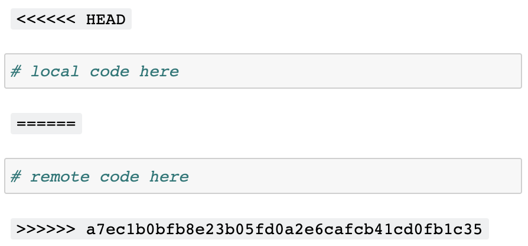

# The Jupyter+git problem is now solved
Jeremy Howard
2022-08-25

*[Originally posted](https://www.fast.ai/2022/08/25/jupyter-git/) on the
fast.ai blog*

> Jupyter notebooks don’t work with git by default. With
> [nbdev2](https://nbdev.fast.ai/), the Jupyter+git problem has been
> totally solved. It provides a set of hooks which provide clean git
> diffs, solve most git conflicts automatically, and ensure that any
> remaining conflicts can be resolved entirely within the standard
> Jupyter notebook environment. To get started, follow the directions on
> [Git-friendly
> Jupyter](https://nbdev.fast.ai/tutorials/git_friendly_jupyter.html).

## The Jupyter+git problem

[Jupyter notebooks](https://Jupyter.org/) are a powerful tool for
scientists, engineers, technical writers, students, teachers, and more.
They provide an ideal
[notebook](https://en.wikipedia.org/wiki/Lab_notebook) environment for
interactively exploring data and code, writing programs, and documenting
the results as dashboards, books, or blogs.

But when collaborating with others, this ideal environment goes up in
smoke. That’s because tools such as git, which are the most popular
approaches for asynchronous collaboration, makes notebooks unusable.
Literally. Here’s what it looks like if you and a colleague both modify
a notebook cell (including, in many cases, simply executing a cell
withuout changing it), and then try to open that notebook later:

<figure>

<figcaption aria-hidden="true">What merge conflicts normally do to
Jupyter Notebooks</figcaption>
</figure>

The reason for this stems from a fundamental incompatibility between the
format Jupyter notebooks use (JSON) and the format that git conflict
markers assume by default (plain lines of text). This is what it looks
like when git adds its conflict markers to a notebook:

       "source": [
    <<<<<< HEAD
        "z=3\n",
    ======
        "z=2\n",
    >>>>>> a7ec1b0bfb8e23b05fd0a2e6cafcb41cd0fb1c35
        "z"
       ]

That’s not valid JSON, and therefore Jupyter can’t open it. Conflicts
are particularly common in notebooks, because Jupyter changes the
following every time you run a notebook:

- Every cell includes a number indicating what order it was run in. If
  you and a colleague run the cells in different orders, you’ll have a
  conflict in every single cell! This would take a very long time to fix
  manually
- For every figure, such as a plot, Jupyter includes not only the image
  itself in the notebook, but also a plain text description that
  includes the `id` (like a memory address) of the object, such as
  `<matplotlib.axes._subplots.AxesSubplot at 0x7fbc113dbe90>`. This
  changes every time you execute a notebook, and therefore will create a
  conflict every time two people execute this cell
- Some outputs may be non-deterministic, such as a notebook that uses
  random numbers, or that interacts with a service that provides
  different outputs over time (such as a weather service)
- Jupyter adds metadata to the notebook describing the environment it
  was last run in, such as the name of the kernel. This often varies
  across installations, and therefore two people saving a notebook (even
  without and other changes) will often end up with a conflict in the
  metadata.

All these changes to notebook files also make git diffs of notebooks
very verbose. This can make code reviews a challenge, and make git repos
more bulky than necessary.

The result of these problems is that many Jupyter users feel that
collaborating with notebooks is a clunky, error-prone, and frustrating
experience. (We’ve even seen people on social media describe Jupyter’s
notebook format as “stupid” or “terrible”, despite otherwise professing
their love for the software!)

It turns out, however, that Jupyter and git can work together extremely
well, with none of the above problems at all. All that’s needed is a bit
of special software…

## The solution

Jupyter and git are both well-designed software systems that provide
many powerful extensibility mechanisms. It turns out that we can use
these to fully and automatically solve the Jupyter+git problem. We
identified two categories of problems in the previous section:

1.  git conflicts lead to broken notebooks
2.  Unnecessary conflicts due to metadata and outputs.

In our newly released [nbdev2](https://nbdev.fast.ai/), an open source
Jupyter-based development platform, we’ve solve each of the problems:

1.  A new *merge driver* for git provides “notebook-native” conflict
    markers, resulting in notebooks that can be opened directly in
    Jupyter, even when there are git conflicts
2.  A new *save hook* for Jupyter automatically removes all unnecessary
    metadata and non-deterministic cell output.

Here’s what a conflict looks like in Jupyter with nbdev’s merge driver:

As you see, the local and remote change are each clearly displayed as
separate cells in the notebook, allowing you to simply delete the
version you don’t want to keep, or combine the two cells as needed.

The techniques used to make the merge driver work are quite fascinating
– let’s dive into the details!

### The nbdev2 git merge driver

We provide here a summary of the git merge driver – for full details and
source code see the [`nbdev.merge`
docs](https://nbdev.fast.ai/api/merge.html). Amazingly enough, the
entire implementation is just 58 lines of code!

The basic idea is to first “undo” the original git merge which created
the conflict, and then “redo” it at a cell level (instead of a line
level) and looking only at cell source (not outputs or metadata). The
“undoing” is straightforward: just create two copies of the conflicted
file (representing the local and remove versions of the file), go
through each git conflict marker, and replace the conflict section with
either the local or remote version of the code.

Now that we’ve got the original local and remote notebooks, we can load
the json using
[`execnb.nbio`](https://fastai.github.io/execnb/nbio.html), which will
then give us an array of cells for each notebook. Now we’re up to the
interesting bit – creating cell-level diffs based only on the cell
source.

The Python standard library contains a very flexible and effective
implementation of a diff algorithm in the `difflib` module. In
particular, the
[`SequenceMatcher`](https://docs.python.org/3/library/difflib.html#difflib.SequenceMatcher)
class provides the fundamental building blocks for implementing your own
conflict resolution system. We pass the two sets of cells (remote and
local) to `SequenceMatcher(...).get_matching_blocks()`, and it returns a
list of each section of cells that match (i.e. have no
conflicts/differences). We can then go through each matching section and
copy them into the final notebook, and through each non-matching section
and copy in each of the remote and local cells (add cells between them
to mark the conflicts).

Making `SequenceMatcher` work with notebook cells (represented in nbdev
by the `NbCell` class) requires only adding `__hash__` and `__eq__`
methods to `NbCell`. In each case, these methods are defined to look
only at the actual source code, and not at any metadata or outputs. As a
result, `SequenceMatcher` will only show differences in source code, and
will ignore differences in everything else.

With a single line of configuration, we can ask git to call our python
script, instead of its default line-based implementation, any time it is
merging changes. `nbdev_install_hooks` sets up this configuration
automatically, so after running it, git conflicts become much less
common, and never result in broken notebooks.

### The nbdev2 Jupyter save hook

Solving git merges locally is extremely helpful, but we need to solve
them remotely as well. For instance, if a contributor submits a pull
request (PR), and then someone else commits to the same notebook before
the PR is merged, the PR might now have a conflict like this:

       "outputs": [
        {
    <<<<<< HEAD
         "execution_count": 7,
    ======
         "execution_count": 5,
    >>>>>> a7ec1b0bfb8e23b05fd0a2e6cafcb41cd0fb1c35
         "metadata": {},

This conflict shows that the two contributors have run cells in
different orders (or perhaps one added a couple of cells above in the
notebook), so their commits have conflicting execution counts. GitHub
will refuse to allow this PR to be merged until this conflict is fixed.

But of course we don’t really care about the conflict at all – it
doesn’t matter what, if any, execution count is stored in the notebook.
So we’d really prefer to ignore this difference entirely!

Thankfully, Jupyter provides a “pre-save” hook which allows code to be
run every time a notebook is saved. nbdev uses this to set up a hook
which removes all unnecessary metadata (including `execution_count`) on
saving. That means there’s no pointless conflicts like the one above,
because no commits will have this information stored in the first place.

## Background

Here at fast.ai we use Jupyter for everything. All our tests,
documentation, and module source code for all of our many libraries is
entirely developed in notebooks (using nbdev, of course!) And we use git
for all our libraries too. Some of our repositories have many hundreds
of contributors. Therefore solving the Jupyter+git problem has been
critical for us. The solution presented here is the result of years of
work by many people.

Our first approach, developed by Stas Bekman and me, was to use git
[“smudge” and “clean”
filters](https://bignerdranch.com/blog/git-smudge-and-clean-filters-making-changes-so-you-dont-have-to/)
that automatically rewrote all notebook json to remove unneeded metadata
when committing. This helped a bit, but git quite often ended up in an
odd state where it was impossible to merge.

In nbdev v1 Sylvain Gugger created an amazing tool called
`nbdev_fix_merge` which used very clever custom logic to manually fix
merge conflicts in notebooks, to ensure that they could opened in
Jupyter. For nbdev v2 I did a from-scratch rewrite of every part of the
library, and I realised that we could replace the custom logic with the
`SequenceMatcher` approach described above.

None of these steps fully resolved the Jupyter+git problem, since we
were getting frequent merge errors caused by the smudge/clean git
filters, and conflicts required manually running `nbdev_fix_merge`.
Wasim Lorgat realised that we could resolve the smudge/clean issue by
moving that logic into an nbdev save hook, and avoid the manual fix step
by moving that logic into a git merge driver. This resolved the final
remaining issues! (I was actually quite stunned that Wasim went from our
first discussion of the outstanding problems, to figuring out how to
solve all of them, in the space of about two days…)

## The result

The new tools in nbdev2, which we’ve been using internally for the last
few months, have been transformational to our workflow. **The
Jupyter+git problem has been totally solved.** I’ve seen no unnecessary
conflicts, cell-level merges have worked like magic, and on the few
occassions where I’ve changed the source in the same cell as a
collaborator, fixing the conflict in Jupyter has been straightforward
and convenient.

## Postscript: other Jupyter+git tools

### ReviewNB

There is one other tool which we’ve found very helpful in using Jupyter
with git, which is [ReviewNB](https://www.reviewnb.com/). ReviewNB
solves the problem of doing pull requests with notebooks. GitHub’s code
review GUI only works well for line-based file formats, such as plain
python scripts. This works fine with the Python modules that nbdev
exports, and I often do reviews directly on the Python files, instead of
the source notebooks.

However, much of the time I’d rather do reviews on the source notebooks,
because:

- I want to review the documentation and tests, not just the
  implementation
- I want to see the changes to cell outputs, such as charts and tables,
  not just the code.

For this purpose, ReviewNB is perfect. Just like nbdev makes git merges
and commits Jupyter-friendly, ReviewNB makes code reviews
Jupyter-friendly. A picture is worth a thousand words, so rather than
trying to explain, I’ll just show this picture from the ReviewNB website
of what PRs look like in their interface:

### An alternative solution: Jupytext

Another potential solution to the Jupyter+git problem might be to use
[Jupytext](https://jupytext.readthedocs.io/en/latest/index.html).
Jupytext saves notebooks in a line-based format, instead of in JSON.
This means that all the usual git machinery, such as merges and PRs,
works fine. Jupytext can even use [Quarto’s](https://quarto.org/)
format, `qmd`, as a format for saving notebooks, which then can be used
to generate a website.

Jupytext can be a bit tricky to manage when you want to save your cell
outputs (which I generally want to do, since many of my notebooks take a
long time to run – e.g training deep learning models.) Whilst Jupytext
can save outputs in a linked `ipynb` file, managing this linkage gets
complex, and ends up with the Jupyter+git problem all over again! If you
don’t need to save outputs, then you might find Jupytext sufficient –
although of course you’ll miss out on the cell-based code reviews of
ReviewNB and your users won’t be able to read your notebooks properly
when they’re browsing GitHub.

### nbdime

There’s also an interesting project called
[nbdime](https://nbdime.readthedocs.io/en/latest/) which has its own git
drivers and filters. Since they’re not really compatible with nbdev
(partly because they tackle some of the same problems in different ways)
I haven’t used them much, so haven’t got an informed opinion about them.
However I do use nbdime’s Jupyter extension sometimes, which provides a
view similar to ReviewNB, but for local changes instead of PRs.

If you want to try to yourself, follow the directions on [Git-friendly
Jupyter](https://nbdev.fast.ai/tutorials/git_friendly_jupyter.html) to
get started.
