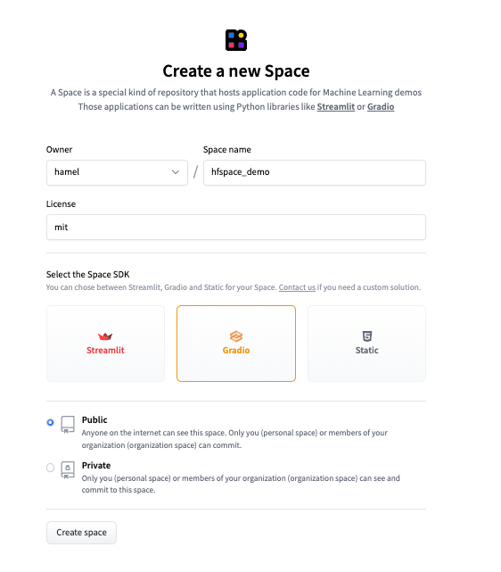
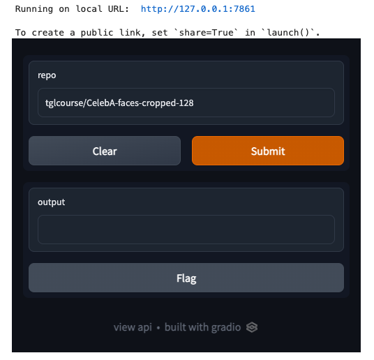

# Create A 🤗 Space From A Notebook
Hamel Husain
2022-11-07

<figure>

<figcaption aria-hidden="true">Image created with Stable Diffusion from
<a
href="https://huggingface.co/spaces/stabilityai/stable-diffusion">this
space</a></figcaption>
</figure>

[Hugging Face Spaces](https://huggingface.co/spaces/launch) provides an
easy ways to deploy a web app with python. [Gradio](https://gradio.app/)
is one of my favorite tools for building these web apps. For example,
the cover-image for this blog post was generated with a [Gradio
App](https://huggingface.co/spaces/stabilityai/stable-diffusion)![1]
Gradio also allows you to prototype your web apps in notebooks which
allows you to iterate fast. Unfortunately, Hugging Face Spaces requires
you to package your web application code as a python script named
`app.py`.

However, **thanks to [nbdev](https://nbdev.fast.ai), you can deploy a
Gradio app to Spaces from a notebook without having to refactor your
code into a script!** When you finish this tutorial, you will have an
app that looks like this:

<figure>
<a href="https://huggingface.co/spaces/hamel/hfspace_demo"></a>
<figcaption><a href="https://huggingface.co/spaces/hamel/hfspace_demo">A
Gradio app</a> that shows the size of a HF Dataset.</figcaption>
</figure>

*The above app allows you to lookup the size of any [Hugging Face
Dataset](https://huggingface.co/docs/datasets/index), using the [Hugging
Face Datasets Server
API](https://huggingface.co/docs/datasets-server/index).*

Authoring your spaces in notebooks offers a number of benefits such as
the ability to:

- Document your code (with `quarto` or `nbdev`)
- Prototype and author your code (with `nbdev.export.export_nb`)
- Test your code (with `nbdev_test`)

… All from the same environment!

## 1. Create a Gradio-enabled Space on Hugging Face

The first step is to create a space and select the appropriate sdk
(which is Gradio in this example), according to [these
instructions](https://huggingface.co/docs/hub/spaces-overview#creating-a-new-space):

<figure>

<figcaption aria-hidden="true">create a Hugging Face Space</figcaption>
</figure>

After you are done creating the space, clone the repo locally. In this
example, I ran the command
`git clone https://huggingface.co/spaces/hamel/hfspace_demo`.

## 2. Create A Notebook

Before getting started you will want to install the dependencies for
this tutorial:

``` python
!pip install git+https://github.com/fastai/nbdev.git gradio fastcore
```

Create a notebook called `app.ipynb` in the root of your newly cloned
repo. Alternatively, download [the
notebook](https://gist.github.com/hamelsmu/35be07d242f3f19063c3a3839127dc67)
and follow along.

<div>

> **Download the notebook and follow along**
>
> This blog post is a verbose version of the “notebook” you can use to
> create a Gradio app. However, it can be useful to see just the code
> without any of the prose. A [concise version of this notebook is
> here](https://gist.github.com/hamelsmu/35be07d242f3f19063c3a3839127dc67).
> I recommend taking a look at this notebook during or after you read
> this blog post.

</div>

## 3. Make an app with Gradio

Below, I will create a [gradio](https://gradio.app/) app in a notebook
and show you how to deploy it to [Hugging Face
Spaces](https://huggingface.co/docs/hub/spaces).

First, lets import the libraries we need, which in this case are
`gradio` and `fastcore`:

``` python
#|export
import gradio as gr
from fastcore.net import urljson, HTTPError
```

Next, write the functions your gradio app will use. Because of
[nbdev](https://nbdev.fast.ai/blog/posts/2022-07-28-nbdev2/), you can
prototype and package your code all in one place. **The special comment
`#|export` marks which cells will be sent to a python script** (more on
this later). Note that there are only three cells in this notebook with
the `#|export` directive.

``` python
#|export
def size(repo:str):
    "Returns the size in GB of a HuggingFace Dataset."
    url = f'https://huggingface.co/api/datasets/{repo}'
    try: resp = urljson(f'{url}/treesize/main')
    except HTTPError: return f'Did not find repo: {url}'
    gb = resp['size'] / 1e9
    return f'{gb:.2f} GB'
```

`size` takes as an input a [Hugging Face
Dataset](https://huggingface.co/docs/datasets/index) repo and returns
the total size in GB of the data.

For example, I can check the size of
[tglcourse/CelebA-faces-cropped-128](https://huggingface.co/datasets/tglcourse/CelebA-faces-cropped-128)
like so:

``` python
size("tglcourse/CelebA-faces-cropped-128")
```

<div class="cell-output">

    '5.49 GB'

</div>

You can construct a simple UI with the `gradio.interface` and then call
the `launch` method of that interface to display a preview in a
notebook. This is a great way to test your app to see if it works:

``` python
#|export
iface = gr.Interface(fn=size, inputs=gr.Text(value="tglcourse/CelebA-faces-cropped-128"), outputs="text")
iface.launch(height=450, width=500)
```

<div class="cell-output">

    Running on local URL:  http://127.0.0.1:7861

    To create a public link, set `share=True` in `launch()`.



</div>

Note how running the `launch()` method in a notebook runs a webserver in
the background. Below, I call the `close()` method to close the
webserver.

``` python
# this is only necessary in a notebook
iface.close()
```

<div class="cell-output">

    Closing server running on port: 7861

</div>

## 4. Convert This Notebook Into A Gradio App

In order to host this code on Hugging Face Spaces, you will export parts
of this notebook to a script named `app.py`. As a reminder, this is what
the special `#|export` comment that you have seen in cells above do! You
can export code from this notebook like so:

``` python
from nbdev.export import nb_export
nb_export('app.ipynb', lib_path='.', name='app')
```

### Understanding what is generated

Notice how the contents of app.py only contain the exported cells from
this notebook:

``` python
!cat app.py
```

<div class="cell-output">

``` python
# AUTOGENERATED! DO NOT EDIT! File to edit: app.ipynb.

# %% auto 0
__all__ = ['iface', 'size']

# %% app.ipynb 6
import gradio as gr
from fastcore.net import urljson, HTTPError

# %% app.ipynb 8
def size(repo:str):
    "Returns the size in GB of a HuggingFace Dataset."
    url = f'https://huggingface.co/api/datasets/{repo}'
    try: resp = urljson(f'{url}/treesize/main')
    except HTTPError: return f'Did not find repo: {url}'
    gb = resp['size'] / 1e9
    return f'{gb:.2f} GB'

# %% app.ipynb 12
iface = gr.Interface(fn=size, inputs=gr.Text(value="tglcourse/CelebA-faces-cropped-128"), outputs="text")
iface.launch(height=450, width=500)
```

</div>

### Fill out `requirements.txt`

You must supply a `requirements.txt` file so the Gradio app knows how to
build your dependencies. In this example, the only dependency other than
Gradio is `fastcore`. You don’t need to specify Gradio itself as a
dependency in `requirements.txt`, so our `requirements.txt` file has
only one dependency:

``` python
%%writefile requirements.txt
fastcore
```

    Writing requirements.txt

*Note: you may want to add operating system dependencies in addition to
python dependencies. You can do this via a `packages.txt` file as
[documented
here](https://huggingface.co/docs/hub/spaces-dependencies#adding-your-own-dependencies).*

## 5. Launch Your Gradio App

To launch your gradio app, you need to commit the changes to the Hugging
Face repo:

``` bash
git add -A; git commit -m "Add application files"; git push
```

# Voilà! Enjoy your Gradio App

After a couple of minutes, you will see your app published! This app is
published [here](https://huggingface.co/spaces/hamel/hfspace_demo).

# Shameless Plug: [nbdev](https://nbdev.fast.ai/blog/posts/2022-07-28-nbdev2/)

Hopefully you felt something magical while doing this example. Even
though the target application required you to write a python script
(`app.py`), you didn’t have to refactor your script from a notebook! I
believe that you shouldn’t have to refactor your code and switch
contexts even when creating python packages! If this intrigues you,
check out [nbdev](https://nbdev.fast.ai/blog/posts/2022-07-28-nbdev2/)

[1] The prompt that generated the cover image is: “A data scientist at a
computer in a futuristic city with a view of the planet Jupyter in the
night sky, trending on artstation, high detail, science-fiction”
