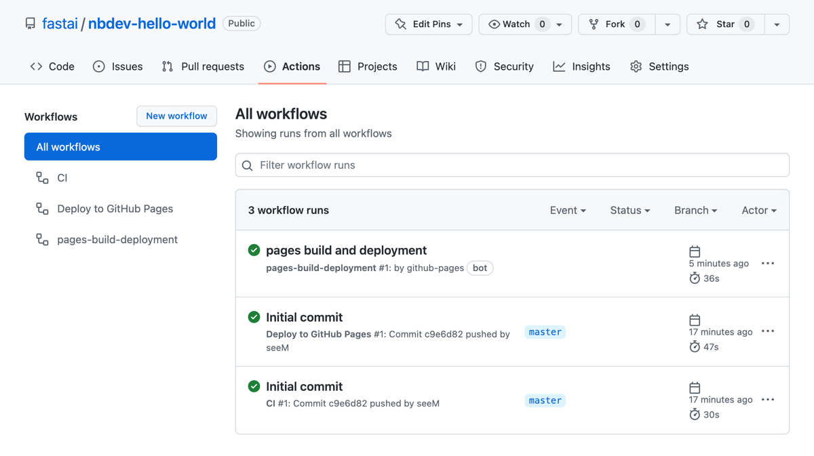

# Docs Website


<!-- WARNING: THIS FILE WAS AUTOGENERATED! DO NOT EDIT! -->

## Concepts

### Source Files

There are two mediums in which you can author documentation in nbdev:

1.  Jupyter Notebooks
2.  Quarto Markdown (.qmd)

For most cases, you will use Jupyter Notebooks. However, you may choose
to author a document in Quarto Markdown if there is no code on that
particular page. When in doubt, we recommend using notebooks as they are
more versatile.

In the case of notebooks, nbdev pre-processes them to add, remove or
change the content before passing it to Quarto. In some cases, nbdev
even executes certain cells in order to render the documentation
properly. The mechanics of this are discussed in the [Notebook
Processor](#notebook-processor) section below.

For markdown files, [Quarto](https://quarto.org) renders these directly.

### Notebook Processor

Nbdev does special pre-processing on notebooks based on the following:

1.  **Directives**: Directives are special comments that allow you to
    perform operations on cells. For example, the comment `#|hide`
    allows you to hide cell inputs and outputs. You can read more about
    directives [on this page](./directives.ipynb). Directives that are
    unique to nbdev and not supported by Quarto are removed from the
    notebook before being passed to Quarto.
2.  **Front Matter**: Front matter allows you to specify document-level
    options so you don’t have to repeat them on each cell. (Similarly,
    `_quarto.yml` allows you to specify project-level options.) You can
    read more about Quarto front-matter
    [here](https://quarto.org/docs/reference/formats/html.html).

The directives and front-matter are used by a **Processing Pipeline** to
transform notebooks. Many of these pre-processing steps are defined in
[`nbdev.processors`](https://github.com/fastai/nbdev/blob/master/nbdev/processors.py),
which are then run by
[`nbdev.process.NBProcessor`](https://nbdev.fast.ai/api/process.html#nbprocessor).
Some of these pre-processing steps involve running code (with
[execnb](https://github.com/fastai/execnb)) in order to dynamically
render API documentation. This process is explained in the [How show_doc
works](#how-show_doc-works) section below.

When generating your docs site, the intermediate output of these
pre-processed notebooks and other quarto project files are saved into a
directory named `_proc/` at the root of your repo. You can inspect the
`_proc/` directory in order to debug or understand how notebooks are
pre-processed.

### Quarto

[Quarto](https://quarto.org/) is the mechanism nbdev uses to generate
web pages from notebooks. It is useful to visit the [Quarto
docs](https://quarto.org/docs/guide/) and understand how it works. nbdev
automatically generates the Quarto configuration files `_quarto.yml` and
`sidebar.yml` for you.

You can override any settings in `_quarto.yml` by defining a
`custom.yml` file. This is explained further in the [Customizing
Quarto](#customizing-quarto) section. We explain how to customize your
sidebar in the [Customizing The Sidebar](#customizing-the-sidebar)
section.

### Static Site

Quarto has a built-in [static site
generator](https://www.cloudflare.com/learning/performance/static-site-generator/)
that will generate HTML, Javascript and CSS files. These files will be
placed in the `doc_path` directory as specified in your project’s
`settings.ini` file, which is `_docs/` by default.

## Overview

Below is a diagram on how these concepts fit together.



## Customizing Quarto

You can create a `custom.yml` file in the same location as your
`_quarto.yml` file to override any values in `_quarto.yml`. For example,
assume your `_quarto.yml` file looks contains this:

<div class="py-2 px-3 mb-4 border rounded shadow-sm" fig-align="center">

``` yaml
website:
  title: "nbdev"
  site-url: "https://nbdev.fast.ai/"
  description: "Create delightful software with Jupyter Notebooks"
  twitter-card: true
  open-graph: true
  repo-branch: master
  repo-url: "https://github.com/fastai/nbdev"
  repo-actions: [issue]
  navbar:
    background: primary
    search: true
    right:
      - icon: github
        href: "https://github.com/fastai/nbdev"
  sidebar:
    style: "floating"
```

</div>

Let’s assume you want to customize your [sidebar navigation
options](https://quarto.org/docs/websites/website-navigation.html#side-navigation)
such that instead of “floating” for `sidebar.style`, you wanted your
navbar to be “docked”. Additionally, lets assume you want a different
background color using the `sidebar.background` field which is not in
the configuration above.

To accomplish these tasks, you would create a `custom.yml` in the same
location as `_quarto.yml` with these contents:

<div class="py-2 px-3 mb-4 border rounded shadow-sm" fig-align="center">

``` yaml
website:
  sidebar:
      style: "docked"
      background: "dark"
```

</div>

<div>

> **Note**
>
> You can also set `custom_quarto_yml = True` in settings.ini if you
> wish to edit `_quarto.yml` directly instead of overriding settings in
> `custom.yml`.

</div>

### Customizing The Sidebar

By default nbdev automatically generates `sidebar.yml`, which specifies
the tree structure of your sidebar. nbdev infers the tree structure by
inspecting the directory structure containing your source files. You can
see an example of this by inspecting the folder structure of [the
notebooks directory in
nbdev](https://github.com/fastai/nbdev/tree/master/nbs) and the
corresponding left-hand sidebar on this website. Leading numbers in
filenames and directories are ignored when naming elements of the
sidebar (which you can see examples of in this project’s notebooks
directory).

To customize the sidebar, you must set `custom_sidebar = true` in
`settings.ini`. This will prevent nbdev from regenerating this file
every time the docs are re-built. This way, you an edit this file
directly instead of overriding the sidebar with `custom.yml`.

## How [`show_doc`](https://nbdev.fast.ai/api/showdoc.html#show_doc) works

When your documention website is built, all functions and classes you
export to source code will be automatically documented with
[`show_doc`](https://nbdev.fast.ai/api/showdoc.html#show_doc). This
function outputs a summary of the symbol, showing its signature,
docstring, and parameters. For instance, if you have this function:

``` python
def say_gday(
    greeting:str="G'day",  # Greeting to use
    strine:bool=True,      # Use incomprehensible Aussie accent?
    dropbears:bool=False): # Also warn about drop-bears?
    "Says g'day, the classic Aussie greeting"
    ...
```

This is how it’s rendered in the documentation, by automatically
generating a temporary cell containing:

<div class="py-2 px-3 mb-4 border rounded shadow-sm overflow-auto"
fig-align="center">

``` python
show_doc(say_gday)
```

------------------------------------------------------------------------

### say_gday

>  say_gday (greeting:str="G'day", strine:bool=True, dropbears:bool=False)

*Says g’day, the classic Aussie greeting*

<table>
<thead>
<tr>
<th></th>
<th><strong>Type</strong></th>
<th><strong>Default</strong></th>
<th><strong>Details</strong></th>
</tr>
</thead>
<tbody>
<tr>
<td>greeting</td>
<td>str</td>
<td>G’day</td>
<td>Greeting to use</td>
</tr>
<tr>
<td>strine</td>
<td>bool</td>
<td>True</td>
<td>Use incomprehensible Aussie accent?</td>
</tr>
<tr>
<td>dropbears</td>
<td>bool</td>
<td>False</td>
<td>Also warn about drop-bears?</td>
</tr>
</tbody>
</table>

</div>

Because this is done automatically any time you build your docs
(including automatically by continuous integration), your documentation
will always contain current information about your code.

You can also document code that’s not created in a notebook, by using
[`show_doc`](https://nbdev.fast.ai/api/showdoc.html#show_doc) with
imported code. For instance, if we wanted to document
[`release_conda`](https://nbdev.fast.ai/api/release.html#release_conda),
we can import it and call `show_doc(release_conda)`:

<div class="py-2 px-3 mb-4 border rounded shadow-sm overflow-auto"
fig-align="center">

``` python
from nbdev.release import release_conda
show_doc(release_conda)
```

------------------------------------------------------------------------

<a
href="https://github.com/fastai/nbdev/blob/master/nbdev/release.py#LNone"
target="_blank" style="float:right; font-size:smaller">source</a>

### release_conda

>  release_conda (path:str='conda', do_build:<function bool_arg>=True,
>                     build_args:str='', skip_upload:<function
>                     store_true>=False, mambabuild:<function store_true>=False,
>                     upload_user:str=None)

Create a `meta.yaml` file ready to be built into a package, and
optionally build and upload it

<table>
<colgroup>
<col style="width: 6%" />
<col style="width: 25%" />
<col style="width: 34%" />
<col style="width: 34%" />
</colgroup>
<thead>
<tr>
<th></th>
<th><strong>Type</strong></th>
<th><strong>Default</strong></th>
<th><strong>Details</strong></th>
</tr>
</thead>
<tbody>
<tr>
<td>path</td>
<td>str</td>
<td>conda</td>
<td>Path where package will be created</td>
</tr>
<tr>
<td>do_build</td>
<td>bool_arg</td>
<td>True</td>
<td>Run <code>conda build</code> step</td>
</tr>
<tr>
<td>build_args</td>
<td>str</td>
<td></td>
<td>Additional args (as str) to send to <code>conda build</code></td>
</tr>
<tr>
<td>skip_upload</td>
<td>store_true</td>
<td>False</td>
<td>Skip <code>anaconda upload</code> step</td>
</tr>
<tr>
<td>mambabuild</td>
<td>store_true</td>
<td>False</td>
<td>Use <code>mambabuild</code> (requires <code>boa</code>)</td>
</tr>
<tr>
<td>upload_user</td>
<td>str</td>
<td>None</td>
<td>Optional user to upload package to</td>
</tr>
</tbody>
</table>

</div>

### Automatic Cell Execution

When your documentation is built, all your manually added
[`show_doc`](https://nbdev.fast.ai/api/showdoc.html#show_doc) cells are
run automatically. nbdev also executes all cells containing an `import`
statement, and all exported cells – that way we can be sure that the
symbol used in your
[`show_doc`](https://nbdev.fast.ai/api/showdoc.html#show_doc) cell is
available.

We don’t, however, execute any other cells. That’s because you wouldn’t
want to wait for your entire notebook to run just to build your docs;
for instance, your docs might demonstrate training a model which takes
hours to complete!

This leads to an important rule when authoring nbdev notebooks:

<div>

> **Warning**
>
> Do not mix `import` statements (or calls to
> [`show_doc`](https://nbdev.fast.ai/api/showdoc.html#show_doc)) with
> other code in a single cell. If you do, *all* the code in that cell
> will be executed every time you build your docs, which might lead to
> errors (since not all previous cells will have been executed.
>
> Instead, put your imports in separate cells, and calls to
> [`show_doc`](https://nbdev.fast.ai/api/showdoc.html#show_doc) should
> contain only that one line of code – the
> [`show_doc`](https://nbdev.fast.ai/api/showdoc.html#show_doc) call.

</div>

Note that nbdev automatically hides the actual `show_doc(...)` line of
code. So your users only see the output.

#### Forcing Cells To Execute

Sometimes you may want to execute additional cells beyond what is
automatically executed by nbdev. For instance, on our [Getting
Started](../getting_started.html) page we show a list of all nbdev
commands, automatically generated with `nbdev_help`. We want this page
to always have the most up to date list of commands and docs, so we want
it to always execute when the docs are rendered. To do that, add the
following directive to the top of a cell:

``` python
#| exec_doc
```

Alternatively, you can get nbdev to automatically execute *all* cells
when rendering your docs, by adding the following to your notebook
frontmatter:

``` markdown
---
exec_all: true
---
```

#### Skipping Execution

Likewise, you can instruct nbdev to not execute any cells when rendering
your docs with the following front matter:

``` markdown
---
skip_showdoc: true
---
```

Or ignore execution for a specific cell with this directive:

``` python
#|eval: false
```

### Why use [`show_doc`](https://nbdev.fast.ai/api/showdoc.html#show_doc)?

Many Python developers use [sphinx
autodoc](https://www.sphinx-doc.org/en/master/usage/extensions/autodoc.html)
to automatically document a whole module all at once. Whilst this can
work reasonably well, we think there are huge benefits for both
developers and users in using nbdev’s approach instead

The premise of nbdev’s approach is that your documentation is important
enough to be worth you taking the time to think carefully though each
thing you want to show your users, what examples you’re going to
provide, maybe adding some images to explain more complex ideas, and so
forth. Jupyter provides a terrific environment for creating just these
kinds of documents. For instance, with Jupyter you can:

- Paste images directly from your clipboard into a cell
- Insert code and have it executed and the results displayed to users
- Create a hierarchy of headings to help structure your page
- …and much more.

With [`show_doc`](https://nbdev.fast.ai/api/showdoc.html#show_doc), you
can insert automatically-updated API details for your library anywhere
in a page. That means that you get to decide exactly how your page
should look, and what information is provided where. You don’t have to
limit yourself to the limits of ASCII art for diagrams, and can include
full end-to-end code walk-through of the processes your users will be
following.

## Previewing Your Site Locally

You can preview your docs anytime by running
[`nbdev_preview`](https://nbdev.fast.ai/api/quarto.html#nbdev_preview).
While in preview mode, you can make updates to notebooks and it will be
reflected (after a small delay) in your browser.

## Deploying Docs With GitHub Actions

If your nbdev project lives in GitHub, we include automation that
deploys your documentation site for you on [GitHub
Pages](https://pages.github.com/).

nbdev comes bundled with a [workflow
file](https://github.com/fastai/nbdev/blob/master/.github/workflows/deploy.yaml)
that enables this automation. This workflow is automatically triggered
whenever you change any of the content in your repo. The following
GitHub Actions workflows will run to generate a docs site (in this
order):

1.  `Deploy to GitHub Pages`: This workflow builds the docs with nbdev.
    This is defined in
    [deploy.yaml](https://github.com/fastai/nbdev/blob/master/.github/workflows/deploy.yaml)
    and references
    [fastai/workflows/quarto-ghp](https://github.com/fastai/workflows/blob/master/quarto-ghp/action.yml).
2.  `pages build and deployment`: This is an internal built-in workflow
    that GitHub provides whenever GitHub pages are enabled.

Should anything go wrong in your page build, you can always look at the
logs of these workflows. Like other workflows, these can be found in the
Actions tab of your repo:



To read more about GitHub Actions, see [their
docs](https://github.com/features/actions).

## Deploying Your Docs On Other Platforms

You can generate all of the static assets for your site (html, css, etc)
by running the command
[`nbdev_docs`](https://nbdev.fast.ai/api/quarto.html#nbdev_docs). After
running this command, all of the files for your documentation site will
be located in the `_docs/` directory (the location is configurable by
`doc_path` in `settings.ini`) at the root of your repository. This
directory is not checked into git and is ignored by `.gitignore`, but
you can use these files to deploy to any hosting platform you want.

You can also use the `quarto publish` command to render your docs on a
wide variety of other platforms, which is discussed in the Quarto docs
[here](https://quarto.org/docs/publishing/other.html). **After running
the command
[`nbdev_docs`](https://nbdev.fast.ai/api/quarto.html#nbdev_docs), the
`quarto publish` command must be run from the root of the `_proc/`
directory**, which is located at the root of your repo. The built-in
help of `quarto publish` provides a good overview of the various targets
available:

<div>

> **Call
> [`nbdev_proc_nbs`](https://nbdev.fast.ai/api/quarto.html#nbdev_proc_nbs)
> and publish from the `_proc/` directory**
>
> To use `quarto publish` with nbdev, you must run the
> [`nbdev_proc_nbs`](https://nbdev.fast.ai/api/quarto.html#nbdev_proc_nbs)
> command to pre-process your notebooks before publishing your docs. As
> a reminder,
> [`nbdev_proc_nbs`](https://nbdev.fast.ai/api/quarto.html#nbdev_proc_nbs)
> creates the directory `_proc/` at the root of your project that Quarto
> uses to render your site.
>
> For example, to publish a site to Netlify you can run the following
> command from the root of your repo:
>
> ``` bash
> nbdev_proc_nbs && cd _proc && quarto publish netlify
> ```

</div>

``` python
!quarto publish -h
```


      Usage:   quarto publish [provider] [path]
      Version: 1.1.75                          
                                               

      Description:

        Publish a document or project. Available providers include:
                                                                   
         - Quarto Pub (quarto-pub)                                 
         - GitHub Pages (gh-pages)                                 
         - RStudio Connect (connect)                               
                                                                   
         - Netlify (netlify)                                       
        Accounts are configured interactively during publishing.   
        Manage/remove accounts with: quarto publish accounts       

      Options:

        -h, --help              - Show this help.                                     
        --id          <id>      - Identifier of content to publish                    
        --server      <server>  - Server to publish to                                
        --token       <token>   - Access token for publising provider                 
        --no-render             - Do not render before publishing.                    
        --no-prompt             - Do not prompt to confirm publishing destination     
        --no-browser            - Do not open a browser to the site after publishing  
        --log         <level>   - Path to log file                                    
        --log-level   <level>   - Log level (info, warning, error, critical)          
        --log-format  <format>  - Log format (plain, json-stream)                     
        --quiet                 - Suppress console output.                            

      Commands:

        help  [command]  - Show this help or the help of a sub-command.

      Examples:

        Publish project (prompt for provider):  quarto publish                                                  
        Publish document (prompt for provider): quarto publish document.qmd                                     
        Publish project to Netlify:             quarto publish netlify                                          
        Publish with explicit target:           quarto publish netlify --id DA36416-F950-4647-815C-01A24233E294 
        Publish project to GitHub Pages:        quarto publish gh-pages                                         
        Publish project to RStudio Connect:     quarto publish connect                                          
        Publish with explicit credentials:      quarto publish connect --server example.com --token 01A24233E294
        Publish without confirmation prompt:    quarto publish --no-prompt                                      
        Publish without rendering:              quarto publish --no-render                                      
        Publish without opening browser:        quarto publish --no-browser                                     
        Manage/remove publishing accounts:      quarto publish accounts                                         
