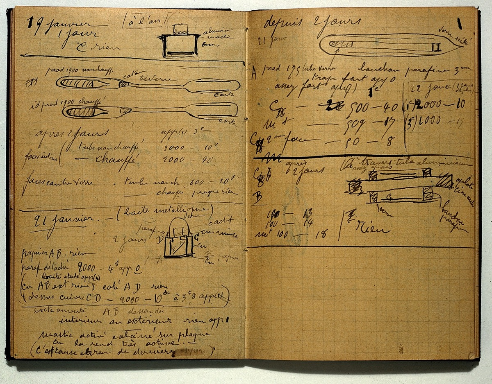
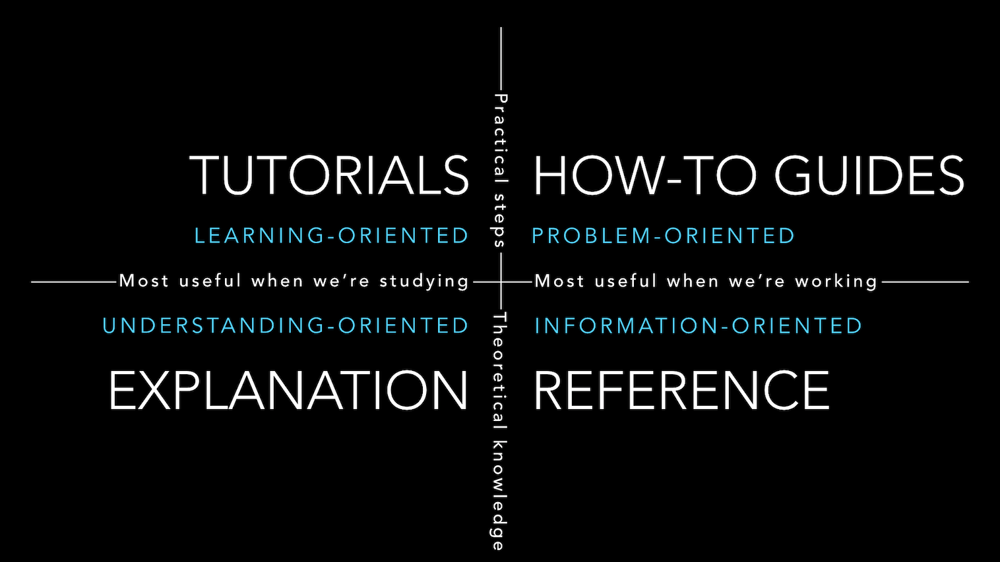

# Notebook Best Practices


<!-- WARNING: THIS FILE WAS AUTOGENERATED! DO NOT EDIT! -->

The flexibility offered by notebooks can be overwhelming. While there
are industry standards for writing Python packages—like
[numpy](https://numpydoc.readthedocs.io/en/latest/format.html#docstring-standard)
and
[sphinx](https://sphinx-rtd-tutorial.readthedocs.io/en/latest/docstrings.html)
docstrings, and [pytest](https://docs.pytest.org/) and
[unittest](https://docs.python.org/3/library/unittest.html) testing
frameworks—they weren’t designed for notebooks.

This article walks you through the practices we’ve learned to leverage
the full power of notebooks with nbdev[1]. Our approach weaves code,
tests, and docs into a single interactive context that invites
experimentation. If you prefer to learn by example, you might want to
start with [the annotated
example](#putting-it-all-together-an-annotated-example) and branch out
from there.

<figure>

<figcaption>Marie Curie’s research notebook dated 19-21 January 1900 (<a
href="https://commons.wikimedia.org/wiki/File:Marie_Curie;_Holograph_Notebook._Wellcome_L0021265.jpg">source</a>).</figcaption>
</figure>

## Know which form of notebook you’re writing

First of all, decide which form of notebook you’re writing. We’re fans
of the [Diátaxis system](https://diataxis.fr/) which classifies
documentation into four forms: tutorials, how-to guides, explanations,
and references. They’ve laid this out beautifully in the following
diagram:

<a href="/images/divio-overview.webp"></a>

## Start with a great title and subtitle

Start with a markdown cell at the top of your notebook with its title in
an H1 header, and subtitle in a blockquote. For example:

``` markdown
# Great title

> And an even better subtitle
```

The title will also be used to reference your page in the sidebar. You
can also optionally add [frontmatter](../api/09_frontmatter.ipynb) to
this cell to customize nbdev and Quarto.

## Introduce your notebook

Introduce your notebook with markdown cells below the title. We
recommend a slightly different approach depending on the [form of
documentation](#know-which-form-of-notebook-youre-writing):

- **Reference:** Start with a brief description of the technical
  component, and an overview that links to the main symbols in the page
  (you might want to [use
  doclinks](#reference-related-symbols-with-doclinks))
- **Tutorials and how-to guides:** Describe what the reader will learn
  and how. Keep it short and get to the subject matter quickly
- **Explanations:** Since these are typically very focused, a short
  description of the topic is often sufficient.

<div>

> **Tip**
>
> Note that Markdown lists such as the one above require a blank line
> above them to be rendered as lists in the documentation, even though
> the notebook viewer will render lists that are not preceded by a blank
> line.

</div>

## Use lots of code examples, pictures, plots, and videos

Take advantage of the richness of notebooks by including code examples,
pictures, plots, and videos.

Here are a few examples to get you started:

- fastai’s documentation makes extensive use of code examples, plots,
  images, and tables, for example, the [computer vision
  intro](https://docs.fast.ai/tutorial.vision.html)
- [`nbdev.release`](../api/18_release.ipynb) opens with a terminal
  screencast demo in SVG format created with
  [asciinema](https://asciinema.org/) and
  [svg-term-cli](https://github.com/marionebl/svg-term-cli)
- The [documentation explanation](../explanations/docs.ipynb#overview)
  describes a complex data pipeline using a [Mermaid
  diagram](https://quarto.org/docs/authoring/diagrams.html)
- The [directives explanation](../explanations/directives.ipynb)
  showcases all of nbdev’s directives with executable examples in
  call-out cards (and makes great use of emojis too!)
- [RDKit](https://www.rdkit.org/docs/Cookbook.html#drawing-molecules-jupyter)
  renders beautiful molecule diagrams

## Keep docstrings short; elaborate in separate cells

While nbdev renders docstrings as markdown, they aren’t rendered
correctly when using `symbol?` or `help(symbol)` and they can’t include
executed code. By splitting longer docstrings across separate code and
markdown cells you can [use code examples, pictures, plots, and
videos](#use-lots-of-code-examples-pictures-plots-and-videos).

We find a single-line summary sufficient for most docstrings.

## Document parameters with docments

[`fastcore.docments`](https://fastcore.fast.ai/docments.html) is a
concise way to document parameters that is beautifully rendered by
nbdev. For example, this function:

``` python
def draw_n(n:int, # Number of cards to draw
           replace:bool=True # Draw with replacement?
          )->list: # List of cards
    "Draw `n` cards."
```

…would include the following table as part of its documentation:

<div class="py-2 px-3 mb-4 border rounded shadow-sm">

<table>
<thead>
<tr>
<th></th>
<th><strong>Type</strong></th>
<th><strong>Default</strong></th>
<th><strong>Details</strong></th>
</tr>
</thead>
<tbody>
<tr>
<td>n</td>
<td>int</td>
<td></td>
<td>Number of cards to draw</td>
</tr>
<tr>
<td>replace</td>
<td>bool</td>
<td>True</td>
<td>Draw with replacement?</td>
</tr>
<tr>
<td><strong>Returns</strong></td>
<td><strong>list</strong></td>
<td></td>
<td><strong>List of cards</strong></td>
</tr>
</tbody>
</table>

</div>

nbdev also supports some numpy docstring sections. For example, this
code snippet would produce the same table (there’s no need to include
types like in the docstring if you already have annotations):

``` python
def draw_n(n:int, replace:bool=True) -> Cards:
    """
    Draw `n` cards.
    
    Parameters
    ----------
    n
        Number of cards to draw
    replace
        Draw with replacement?
        
    Returns
    -------
    cards
        List of cards
    """
```

<div>

> **Tip**
>
> You can render a symbol’s parameters table directly with
> [`DocmentTbl`](https://nbdev.fast.ai/api/showdoc.html#docmenttbl). In
> fact, that’s how we rendered the table above.

</div>

## Make code cells short, and demonstrate them immediately

In notebooks, do not create long functions and classes with comments
interspersed throughout them. Instead, split your code up into small
separate cells with explanations and working examples after each. This
lets the user understand how each part works and experiment with them
straight away. It also helps you during development because you can
explore the behavior of every part of your code interactively.

In non-notebook coding, the documentation, tests, code, and examples are
all separate. This is not the case with nbdev. Take advantage of this by
keeping all of these things as close together as possible. This is
helpful both for exploration and for documentation.

For example, consider the section of the Claudette source notebook for
[implementing image
support](https://claudette.answer.ai/core.html#images). The section
immediately imports an image and displays it, showing how to work with a
file format. It then creates a number of helper functions, describes and
demonstrates them, and finally puts it all together to show how to use
the complete feature in practice with real inputs and outputs running
directly in the notebook.

In order to avoid long class definitions caused by many methods,
consider using fastcore’s `patch` decorator to implement each method
separately, and immediately document, demonstrate, and test it.

## Consider turning code examples into tests by adding assertions

nbdev blurs the lines between code, docs, and tests. *Every* code cell
is run as a test (unless it’s explicitly marked otherwise), and any
error in the cell fails the test.

Consider turning your code examples into tests by adding assertions – if
they would make valuable tests and if it doesn’t hurt readability.
[`fastcore.test`](https://fastcore.fast.ai/test.html) provides a set of
light wrappers around `assert` for better notebook tests (for example,
they print both objects on error if they differ).

Here’s an example using
[`fastcore.test.test_eq`](https://fastcore.fast.ai/test.html#test_eq):

``` python
def inc(x): return x + 1
test_eq(inc(3), 4)
```

## Document error-cases as tests

Docstring-driven approaches typically document the errors raised by an
object using plaintext descriptions, for example, in a “raises” section.

In nbdev, we recommend documenting errors with actual failing code using
[`fastcore.test.test_fail`](https://fastcore.fast.ai/test.html#test_fail).
For example:

``` python
def divide(x, y): return x / y
test_fail(lambda: divide(1, 0), contains="division by zero")
```

The first argument is a `lambda` since we need to allow `test_fail` to
control its execution and catch any errors.

## Reference related symbols with doclinks

If you surround a symbol with backticks, nbdev will automatically link
to that symbol’s reference page. We call these
[doclinks](../api/05_doclinks.ipynb).

Prefer fully qualified symbol paths, like `package.module.symbol`
instead of `symbol`. It may be more verbose but it helps users know
which module a symbol originates from, which is especially important for
third-party packages.

Any package created with nbdev will automatically support doclinks.
Non-nbdev packages can be supported by creating a minimal nbdev-index
package. [`nbdev-index`](https://github.com/fastai/nbdev-index) is a
collection of such packages, which already supports django, numpy,
pandas, pytorch, scipy, sphinx, the Python standard library, and even
other programming languages like APL!

## Add rich representations to your classes

This is another way to take advantage of the [rich display feature of
notebooks](https://ipython.readthedocs.io/en/stable/config/integrating.html#rich-display).
You can provide rich representations to your object by defining a
`_repr_markdown_` method that returns markdown text (which may also
include HTML/CSS).

Here’s a simple example to get you started:

``` python
class Color:
    def __init__(self, color): self.color = color
    def _repr_markdown_(self):
        style = f'background-color: {self.color}; width: 50px; height: 50px; margin: 10px'
        return f'<div style="{style}"></div>'
```

``` python
Color('green')
```

<div style="background-color: green; width: 50px; height: 50px; margin: 10px">

</div>

``` python
Color('blue')
```

<div style="background-color: blue; width: 50px; height: 50px; margin: 10px">

</div>

Also see [the earlier list of example
projects](#use-lots-of-code-examples-pictures-plots-and-videos) that
make use of beautiful visual representations.

## Document class methods with [`show_doc`](https://nbdev.fast.ai/api/showdoc.html#show_doc) or [`fastcore.basics.patch`](https://fastcore.fast.ai/basics.html#patch)

nbdev automatically documents exported function and class definitions
with [`show_doc`](https://nbdev.fast.ai/api/showdoc.html#show_doc).
However, it’s up to you to document class methods. There are two ways to
do that: calling
[`show_doc`](https://nbdev.fast.ai/api/showdoc.html#show_doc) on the
method, or defining the method with the
[`fastcore.basics.patch`](https://fastcore.fast.ai/basics.html#patch)
decorator.

<div class="panel-tabset">

### Notebook (show_doc)

If your class is defined in a single cell, use
[`show_doc`](https://nbdev.fast.ai/api/showdoc.html#show_doc). Here’s
what your notebook might look like:

<div class="pt-4 pb-1 px-3 mb-2 border rounded shadow-sm">

``` python
#| export
class Number:
    "A number."
    def __init__(self, num): self.num = num
    def __add__(self, other):
        "Sum of this and `other`."
        return Number(self.num + other.num)
    def __repr__(self): return f'Number({self.num})'
```

For example, here is the number 5:

``` python
Number(5)
```

``` python
show_doc(Number.__add__)
```

For example:

``` python
Number(3) + Number(4)
```

</div>

### Notebook (@patch)

If you split your class definition across cells with
[`fastcore.basics.patch`](https://fastcore.fast.ai/basics.html#patch),
here’s what your notebook might look like:

<div class="pt-4 pb-1 px-3 mb-2 border rounded shadow-sm">

``` python
#| export
class Number:
    "A number."
    def __init__(self, num): self.num = num
    def __repr__(self): return f'Number({self.num})'
```

For example, here is the number 5:

``` python
Number(5)
```

``` python
#| export
@patch
def __add__(self:Number, other):
    "Sum of this and `other`."
    return Number(self.num + other.num)
```

For example:

``` python
Number(3) + Number(4)
```

</div>

### Docs

In either case, this is how the documentation would be rendered:

<div>

------------------------------------------------------------------------

### Number

>  Number (num)

A number.

For example, here is the number 5:

``` python
Number(5)
```

    Number(5)

------------------------------------------------------------------------

### Number.\_\_add\_\_

>  Number.__add__ (other)

Sum of this and `other`.

For example:

``` python
Number(3) + Number(4)
```

    Number(7)

</div>

</div>

## Group symbols with H2 sections

As your notebooks grow, consider grouping related symbols using markdown
cells with level 2 headers. Since nbdev displays documented symbols as
level 3 headers, this would group all symbols below your level 2 header.

Here is the markdown syntax:

``` markdown
## Section title
```

## Split long explanations with H4 sections

Similar to the previous section, as a symbol’s explanation grows,
consider grouping its cells using level 4 headers. This is the
recommended way to structure your reference docs, for example, to
achieve numpy-style structures with sections like notes, examples,
methods, and so on.

Here’s the markdown syntax:

``` markdown
#### Section title
```

## Putting it all together: an annotated example

In this section, we’ll guide you through a full example of writing a
documented and tested function in a notebook using all of the principles
described above. We’ll use the
[`numpy.all`](https://numpy.org/doc/stable/reference/generated/numpy.all.html#numpy.all)
function since it follows the widely-known numpy-docstring standard for
.py files.

Below is the definition of the
[`numpy.all`](https://numpy.org/doc/stable/reference/generated/numpy.all.html#numpy.all)
function. Take note of how all of the information is included in the
docstring. While this works well for .py files, it doesn’t let us weave
executable code with rich markdown as we can in notebooks:

``` python
def all(a, axis=None, out=None, keepdims=np._NoValue, *, where=np._NoValue):
    """
    Test whether all array elements along a given axis evaluate to True.
    Parameters
    ----------
    a : array_like
        Input array or object that can be converted to an array.
    axis : None or int or tuple of ints, optional
        Axis or axes along which a logical AND reduction is performed.
        The default (``axis=None``) is to perform a logical AND over all
        the dimensions of the input array. `axis` may be negative, in
        which case it counts from the last to the first axis.
        .. versionadded:: 1.7.0
        If this is a tuple of ints, a reduction is performed on multiple
        axes, instead of a single axis or all the axes as before.
    out : ndarray, optional
        Alternate output array in which to place the result.
        It must have the same shape as the expected output and its
        type is preserved (e.g., if ``dtype(out)`` is float, the result
        will consist of 0.0's and 1.0's). See :ref:`ufuncs-output-type` for more
        details.
    keepdims : bool, optional
        If this is set to True, the axes which are reduced are left
        in the result as dimensions with size one. With this option,
        the result will broadcast correctly against the input array.
        If the default value is passed, then `keepdims` will not be
        passed through to the `all` method of sub-classes of
        `ndarray`, however any non-default value will be.  If the
        sub-class' method does not implement `keepdims` any
        exceptions will be raised.
    where : array_like of bool, optional
        Elements to include in checking for all `True` values.
        See `~numpy.ufunc.reduce` for details.
        .. versionadded:: 1.20.0
    Returns
    -------
    all : ndarray, bool
        A new boolean or array is returned unless `out` is specified,
        in which case a reference to `out` is returned.
    See Also
    --------
    ndarray.all : equivalent method
    any : Test whether any element along a given axis evaluates to True.
    Notes
    -----
    Not a Number (NaN), positive infinity and negative infinity
    evaluate to `True` because these are not equal to zero.
    Examples
    --------
    >>> np.all([[True,False],[True,True]])
    False
    >>> np.all([[True,False],[True,True]], axis=0)
    array([ True, False])
    >>> np.all([-1, 4, 5])
    True
    >>> np.all([1.0, np.nan])
    True
    >>> np.all([[True, True], [False, True]], where=[[True], [False]])
    True
    >>> o=np.array(False)
    >>> z=np.all([-1, 4, 5], out=o)
    >>> id(z), id(o), z
    (28293632, 28293632, array(True)) # may vary
    """
    ...
```

Alternatively, Here is how we’d write
[`numpy.all`](https://numpy.org/doc/stable/reference/generated/numpy.all.html#numpy.all)
in a notebook using nbdev. The first step is to define the function:

<div class="column-screen-inset-right">

``` python
#| export
def all(a, # Input array or object that can be converted to an array.
        axis:int|tuple|None=None, # Axis or axes along which a logical AND reduction is performed (default: all).
        out:np.ndarray|None=None, # Alternate output array in which to place the result.
        keepdims:bool=np._NoValue, # Leave reduced one-dimensional axes in the result?
        where=np._NoValue, # Elements to include in reduction. See `numpy.ufunc.reduce` for details. New in version 1.20.0.
        ) -> np.ndarray|bool: # A new boolean or array, or a reference to `out` if its specified.
    "Test whether all array elements along a given axis evaluate to `True`."
    ...
```

</div>

We can observe the following differences between this code and
numpy-docstrings:

- The definition uses simple type annotations, which will be rendered in
  the function’s parameters table below
- Parameters are described with a short comment, called
  [docments](#document-parameters-with-docments) – a concise alternative
  to numpy and sphinx docstring formats (although nbdev does support
  numpy docstrings see [this
  example](#document-parameters-with-docments))
- The docstring and parameter descriptions are all short, single-line
  summaries. We prefer to [keep docstrings short and instead elaborate
  in separate
  cells](#keep-docstrings-short-elaborate-in-separate-cells), where we
  can use markdown and real code examples.

Note: the use of `|` syntax for unions e.g. `int|tuple|None` (equivalent
to `Union[int, tuple, None]`) requires using Python 3.10 or by treating
all annotations as strings using `from __future__ import annotations`
which is available from Python 3.7.

Our function definition is automatically rendered in the docs like this.
Note that parameter names, types, defaults, and details are all parsed
from the definition which means you don’t have to repeat yourself.

<div class="pt-2 pb-1 px-3 mt-2 mb-4 border rounded shadow-sm overflow-auto">

------------------------------------------------------------------------

### all

>  all (a, axis:Union[int,tuple,NoneType]=None,
>           out:Optional[numpy.ndarray]=None, keepdims:bool=<no value>,
>           where=<no value>)

Test whether all array elements along a given axis evaluate to `True`.

<table>
<colgroup>
<col style="width: 6%" />
<col style="width: 25%" />
<col style="width: 34%" />
<col style="width: 34%" />
</colgroup>
<thead>
<tr>
<th></th>
<th><strong>Type</strong></th>
<th><strong>Default</strong></th>
<th><strong>Details</strong></th>
</tr>
</thead>
<tbody>
<tr>
<td>a</td>
<td></td>
<td></td>
<td>Input array or object that can be converted to an array.</td>
</tr>
<tr>
<td>axis</td>
<td>int | tuple | None</td>
<td>None</td>
<td>Axis or axes along which a logical AND reduction is performed
(default: all).</td>
</tr>
<tr>
<td>out</td>
<td>np.ndarray | None</td>
<td>None</td>
<td>Alternate output array in which to place the result.</td>
</tr>
<tr>
<td>keepdims</td>
<td>bool</td>
<td><no value></td>
<td>Leave reduced one-dimensional axes in the result?</td>
</tr>
<tr>
<td>where</td>
<td>_NoValueType</td>
<td><no value></td>
<td>Elements to include in reduction. See <a
href="https://numpy.org/doc/stable/reference/generated/numpy.ufunc.reduce.html#numpy.ufunc.reduce"><code>numpy.ufunc.reduce</code></a>
for details. New in version 1.20.0.</td>
</tr>
<tr>
<td><strong>Returns</strong></td>
<td><strong>np.ndarray | bool</strong></td>
<td></td>
<td><strong>A new boolean or array, or a reference to <code>out</code>
if its specified.</strong></td>
</tr>
</tbody>
</table>

</div>

Next, describe how to use your function using markdown cells and [lots
of code examples](#use-lots-of-code-examples-pictures-plots-and-videos).
This is the biggest benefit to developing in notebooks: instead of
copying and pasting code examples into plaintext, you can include real
executeable code examples.

We start with basic usage first:

<div class="pt-3 pb-1 px-3 mt-2 mb-4 border rounded shadow-sm">

For example:

``` python
x = [[True,False],[True,True]]
test_eq(np.all(x), False)
```

</div>

Our code examples [use assertion functions from
`fastcore.test`](#consider-turning-code-examples-into-tests-by-adding-assertions),
so that they serve as both docs and tests.
[`nbdev_test`](https://nbdev.fast.ai/api/test.html#nbdev_test) runs
every code cell as a test (unless it’s explicitly marked otherwise), and
any error in the cell fails the test.

Having described basic usage, we now elaborate on more advanced
functionality for each parameter. This differs from numpy’s approach
which includes all parameter docs in the table and where not all
parameters have code examples.

<div class="pt-3 pb-1 px-3 mt-2 mb-4 border rounded shadow-sm">

With `axis`:

``` python
test_eq(np.all(x, axis=0), [True,False])
```

`axis` may be negative, in which case it counts from the last to the
first axis:

``` python
test_eq(np.all(x, axis=-1), [False,True])
```

If `axis` is a tuple of ints, a reduction is performed on multiple axes,
instead of a single axis or all the axes as before.

``` python
test_eq(np.all(x, axis=(0,1)), False)
```

Integers, floats, not a number (nan), and infinity all evaluate to
`True` because they’re not equal to zero:

``` python
test_eq(np.all([-1, 1, -1.0, 1.0, np.nan, np.inf, -np.inf]), True)
```

You can use `where` to test specific elements. For example, this tests
only the second column:

``` python
test_eq(np.all(x, where=[[False],[True]]), True)
```

The output can be stored in an optional `out` array. If provided, a
reference to `out` will be returned:

``` python
o = np.array(False)
z = np.all([-1, 4, 5], out=o)
test_is(z, o)
test_eq(z, True)
```

`out` must have the same shape as the expected output and its type is
preserved (e.g., if `dtype(out)` is float, the result will consist of
0.0’s and 1.0’s). See [Output type
determination](https://numpy.org/doc/stable/user/basics.ufuncs.html#ufuncs-output-type)
for more details.

With `keepdims`, the result will broadcast correctly against the input
array.

``` python
test_eq(np.all(x, axis=0, keepdims=True), [[True, False]]) # Note the nested list
```

If the default value is passed, then `keepdims` will not be passed
through to the `all` method of sub-classes of `ndarray`, however any
non-default value will be. If the sub-class’ method does not implement
`keepdims` any exceptions will be raised.

``` python
class MyArray(np.ndarray):
    def all(self, axis=None, out=None): ...

y = MyArray((2,2))
y[:] = x
np.all(y) # No TypeError since `keepdims` isn't passed
test_fail(lambda: np.all(y, keepdims=True), contains="all() got an unexpected keyword argument 'keepdims'")
```

</div>

Since we prefer to document via code examples, we also document
error-cases with assertions using
[`fastcore.test.test_fail`](https://fastcore.fast.ai/test.html#test_fail).
This differs from docstring-based approaches which usually document
error-cases in prose, usually in a “raises” section of the docstring.

Finally, we link to related symbols with
[doclinks](#reference-related-symbols-with-doclinks) (symbols surrounded
in backticks are automatically linked) and describe their relation using
code examples.

<div class="pt-3 pb-1 px-3 mt-2 mb-4 border rounded shadow-sm">

The
[`numpy.ndarray.all`](https://numpy.org/doc/stable/reference/generated/numpy.ndarray.all.html#numpy.ndarray.all)
method is equivalent to calling
[`numpy.all`](https://numpy.org/doc/stable/reference/generated/numpy.all.html#numpy.all)
with the array:

``` python
test_eq(np.array(x).all(), np.all(x))
```

In contrast,
[`numpy.any`](https://numpy.org/doc/stable/reference/generated/numpy.any.html#numpy.any)
tests whether *any* element evaluates to `True` (rather than *all*
elements):

``` python
test_eq(np.any(x), True)
```

</div>

### Recap

In summary, here is how the nbdev version of
[`numpy.all`](https://numpy.org/doc/stable/reference/generated/numpy.all.html#numpy.all)
differs from the numpy docstring. nbdev uses:

- Type annotations and docments instead of the numpy docstring format
  (although nbdev supports numpy docstrings too)
- Short parameter descriptions, with details in separate cells with
  markdown and code example
- Doclinks to related symbols instead of a “See also” section
- Lots of code examples (which are also tests) mixed with prose to
  describe how to use the function
- Code examples with assertions to document error-cases instead of a
  “Raises” section.

[1] We’re always open to improving our workflows and don’t like to be
too prescriptive about style. If you have any ideas, please feel free to
post them in the [forum](https://forums.fast.ai/c/nbdev/48).
