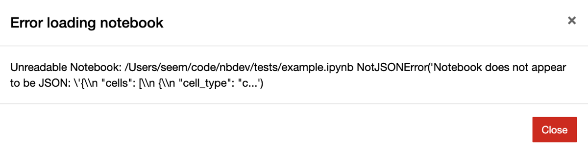

# Git-Friendly Jupyter


<!-- WARNING: THIS FILE WAS AUTOGENERATED! DO NOT EDIT! -->

Version control is essential to developing software, yet Jupyter
notebooks don’t work with version control by default. nbdev solves this
problem! It provides a set of hooks which enable git-friendly Jupyter
notebooks in any git repo, including those that don’t use the broader
nbdev system.

To get started, install nbdev:

<div class="panel-tabset">

#### pip

``` sh
pip install -U nbdev
```

#### conda

``` sh
conda install -c fastai nbdev
```

</div>

then install hooks:

``` sh
nbdev_install_hooks
```

That’s it! Read on if you’re stuck or if you’d like to learn more about
nbdev hooks and how to customise them. Check out [our related blog
post](https://www.fast.ai/2022/08/25/jupyter-git/) if you’re curious
about how this feature was developed and how it works under the hood.

<div>

> **Note**
>
> The [clean hook](#nbdev_clean-on-saving-notebooks-in-jupyter)
> currently only supports Jupyter Notebook and Jupyter Lab. If you’re
> using another notebook editor, like VSCode or PyCharm, you might want
> to use [nbdev’s pre-commit hooks](../tutorials/pre_commit.ipynb).

</div>

## Quickstart: Install nbdev hooks for a repo

To start with, change directory to your current project and
double-check. Don’t worry about the strange path, that’s because we’re
using a temporary directory for this tutorial:

``` sh
pwd
```

    /private/var/folders/ft/0gnvc3ts5jz4ddqtttp6tjvm0000gn/T/tmpez8nec5v/repo

Install nbdev:

``` sh
pip install -Uqq nbdev
```

Install nbdev hooks:

``` sh
nbdev_install_hooks
```

    Not in a git repository, git hooks cannot be installed.

You’ll see the above error if you’re not in a git repo. If so,
initialise a git repository:

``` sh
git init
```

    Initialized empty Git repository in /private/var/folders/ft/0gnvc3ts5jz4ddqtttp6tjvm0000gn/T/tmpez8nec5v/repo/.git/

Then try installing nbdev hooks again:

``` sh
nbdev_install_hooks
```

    Hooks are installed.

If you already have a pre-save hook set in your Jupyter config file we
won’t be able to safely install a new one automatically. Instead, you’ll
encounter an error and will need to follow its instructions for a manual
installation.

Jupyter hooks will now be installed in your user’s Jupyter config
directory, and will work for all repos by default. Git hooks will only
be installed in the current repo; **you will need to rerun
[`nbdev_install_hooks`](https://nbdev.fast.ai/api/clean.html#nbdev_install_hooks)
for each of your git repos**. See [configuring nbdev
hooks](#configuring-nbdev-hooks) if you’d like to customise hook
behaviour, for example, to opt out of hooks in certain repos.

## What are nbdev hooks?

nbdev provides three hooks to ease Jupyter-git integration.

### [`nbdev_merge`](https://nbdev.fast.ai/api/merge.html#nbdev_merge) on merging notebooks with git

One of the biggest complaints when working with Jupyter is that merge
conflicts break notebooks. This is particularly problematic in projects
with many collaborators.

<figure>

<figcaption aria-hidden="true">Jupyter notebook shows the above error
when opening a notebook with merge conflicts.</figcaption>
</figure>

Oftentimes these conflicts are on metadata like cell execution counts
that we don’t really care about. nbdev comes with a custom git merge
driver that automatically fixes conflicting outputs and metadata, and
that leaves remaining conflicts in a state that still works with
Jupyter. It works in all git commands that use merge under the hood,
including `merge`, `pull`, `rebase`, and `stash`.

Here’s what the conflict looks like in Jupyter with nbdev’s merge
driver:


### [`nbdev_clean`](https://nbdev.fast.ai/api/clean.html#nbdev_clean) on saving notebooks in Jupyter

Jupyter notebooks store a variety of metadata (including execution
counts and notebook extension info) that aren’t conducive to
collaborative version control systems like git. These pollute diffs in
pull requests and git histories (which can make debugging harder), and
tend to cause merge conflicts. For example:

``` diff
  {
   "cell_type": "code",
-  "execution_count": 1,
+  "execution_count": 2,
   "metadata": {
     "hide_input": false
  }
```

Python’s default repr is another example, since it includes a memory
address which we usually aren’t interested in:

``` diff
-<matplotlib.axes._subplots.AxesSubplot at 0x7fbc11508950>
+<matplotlib.axes._subplots.AxesSubplot at 0x7fbc113dbe90>
```

nbdev install a Jupyter hook which runs
[`nbdev_clean`](https://nbdev.fast.ai/api/clean.html#nbdev_clean) to
automatically clean unwanted metadata and outputs from your notebooks,
including ids from default Python reprs! With nbdev hooks, the examples
above would become:

``` json
{
  "cell_type": "code",
  "execution_count": null,
  "metadata": {}
}
```

and

    <matplotlib.axes._subplots.AxesSubplot>

### [`nbdev_trust`](https://nbdev.fast.ai/api/clean.html#nbdev_trust) after merging notebooks with git

A side-effect of Jupyter’s security model is that widgets don’t work in
collaborative repos, unless you manually “trust” notebooks after each
`git pull`. There is a good reason behind this: since Jupyter notebooks
contain HTML and JavaScript, the trust system avoids running malicious
code when you open a notebook and don’t explicitly run any cells. See
[the official
documentation](https://jupyter-server.readthedocs.io/en/latest/operators/security.html#security-in-notebook-documents)
for more.

Manually trusting notebooks each time is a pain. A more natural workflow
would be trust a repo once-off, and all notebooks and changes
thereafter. nbdev includes a git post-merge hook which runs
[`nbdev_trust`](https://nbdev.fast.ai/api/clean.html#nbdev_trust) in
your repo to do exactly this.

## Configuring nbdev hooks

The most up-to-date reference of nbdev’s settings is in the
[`nbdev_create_config`](https://nbdev.fast.ai/api/config.html#nbdev_create_config)
docs. In addition, this section will guide you through a few common
configurations.

**Control whether Jupyter hooks are run:**

- Globally enable Jupyter hooks: set `jupyter_hooks = True` in user
  settings
- Globally disable Jupyter hooks: set `jupyter_hooks = False` in user
  settings (at `~/.config/nbdev/settings.ini`)
- Enable Jupyter hooks only for selected repos: set
  `jupyter_hooks = False` in user settings and `jupyter_hooks = True` in
  selected repo settings

**Customise notebook cleaning with the following settings:**

- Clean *all* outputs and metadata: `clear_all`
- Preserve certain metadata by key: `allowed_metadata_keys` and
  `allowed_cell_metadata_keys`
- Clean `id`s from default Python `repr`s: `clean_ids`

All of the above can be customised per-user and per-repo.

**Control whether git hooks are run:**

Since git hooks are installed per-repo they’ll only run in repos where
you manually
[`nbdev_install_hooks`](https://nbdev.fast.ai/api/clean.html#nbdev_install_hooks).
If you change your mind later, you can uninstall git hooks by following
the instructions in the `.gitconfig` file created in your repo.
