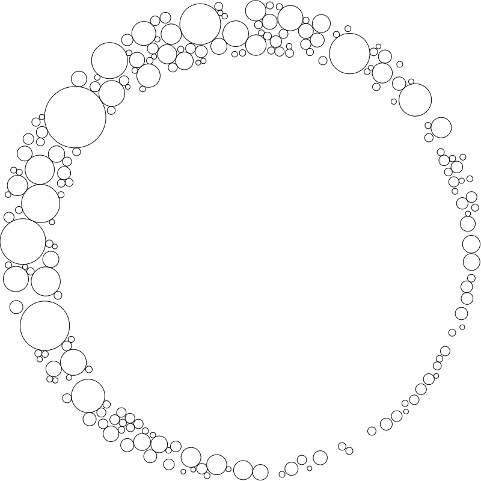

# RenderScripts


*RenderScripts* are regular Python scripts, except that:

- Rather than just having the extension `.py`, they have an extension
  like `.qmd.py`
- They contain a module docstring containing
  [frontmatter](https://quarto.org/docs/tools/jupyter-lab.html#yaml-front-matter)
  (i.e three hyphens on a line, then some yaml, then another three
  hyphens on a line).

These scripts are run when your site is rendered. Anything that they
print to stdout becomes a new file in your site. The name of the file is
the same as the name of the .py script, but without the `.py` extension.
For instance, the page you’re reading right now page is created by a
script called `renderscript.qmd.py`, which you’ll [find
here](https://github.com/fastai/nbdev/blob/master/nbs/tutorials/renderscript.qmd.py).

Hot/live reloading even works with these .py scripts – so as soon as you
save the script, you’ll see the new output in your web browser.

This approach can be particularly helpful for generating data-driven
documents. For instance, consider this table, containing a list of the
people with testimonials on nbdev’s home page:

<table>
<colgroup>
<col style="width: 12%" />
<col style="width: 37%" />
<col style="width: 50%" />
</colgroup>
<thead>
<tr>
<th></th>
<th>Name</th>
<th>Position</th>
</tr>
</thead>
<tbody>
<tr>
<td></td>
<td>Chris Lattner</td>
<td>Inventor of Swift and LLVM</td>
</tr>
<tr>
<td></td>
<td>Fernando Pérez</td>
<td>Creator of Jupyter</td>
</tr>
<tr>
<td></td>
<td>David Berg</td>
<td>Software Engineer, Netflix</td>
</tr>
<tr>
<td></td>
<td>Erik Gaasedelen</td>
<td>Software Engineer, Lyft</td>
</tr>
<tr>
<td></td>
<td>Roxanna Pourzand</td>
<td>Product Manager, Transform</td>
</tr>
<tr>
<td></td>
<td>Hugo Bowne-Anderson</td>
<td>Head of Developer Relations, Outerbounds</td>
</tr>
</tbody>
</table>

When creating a table like this, it can be tricky to ensure that
markdown is correct and consistent for every row. It can be easier and
more maintainable to programatically generate it. The table above is
generated from the following python list:

<div class="column-screen-inset-right">

``` python
testimonials = [
    ('chris-lattner.png', 'Chris Lattner', 'Inventor of Swift and LLVM'),
    ('fernando-pérez.jpeg', 'Fernando Pérez', 'Creator of Jupyter'),
    ('david-berg.jpeg', 'David Berg', 'Software Engineer, Netflix'),
    ('erik-gaasedelen.jpeg', 'Erik Gaasedelen', 'Software Engineer, Lyft'),
    ('roxanna-pourzand.jpeg', 'Roxanna Pourzand', 'Product Manager, Transform'),
    ('hugo-bowne-anderson.jpeg', 'Hugo Bowne-Anderson', 'Head of Developer Relations, Outerbounds')
]
```

</div>

To produce the table from this python list, the following four lines of
code are used:

``` python
print(qmd.tbl_row(['','Name','Position']))
print(qmd.tbl_sep([1,3,4]))
for fname,name,position in testimonials:
    print(qmd.tbl_row([im(fname, 60), name, position]))
```

[`tbl_hdr`](https://nbdev.fast.ai/api/qmd.html#tbl_hdr) and
[`tbl_row`](https://nbdev.fast.ai/api/qmd.html#tbl_row) are two
functions imported from the module `nbdev.qmd`.
[`nbdev.qmd`](https://nbdev.fast.ai/api/qmd.html) is a small module that
has some convenient functions for creating `.qmd` documents, such as the
table creation functions used above. You can see more examples of their
use in
[index.qmd.py](https://github.com/fastai/nbdev/blob/master/nbs/index.qmd.py),
which is the RenderScript which creates the [nbdev home
page](https://nbdev.fast.ai). The nbdev home page is a more idiomatic
example of how to use RenderScripts than the current page’s source code
– we’re only using RenderScript for the current page to provide a more
simple example. In practice, we find that RenderScripts are best used
for pages containing a lot of data-driven content, reusable components,
and so forth.

You can use RenderScripts to create any kind of file. For instance, the
SVG below is created dynamically using [this
script](https://github.com/fastai/nbdev/blob/master/nbs/images/circles.svg.py):



Once you’ve run `nbdev_preview` or `nbdev_docs` you’ll find your
rendered document in the `_proc` directory, along with all of your
processed notebooks. This can be helpful for debugging. You can also
simply call your script directly from the shell
(e.g. `python renderscript.qmd.py`) to view the printed output.
