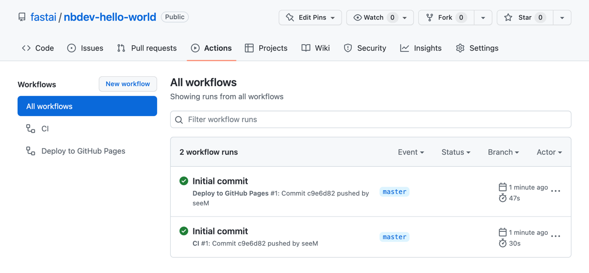
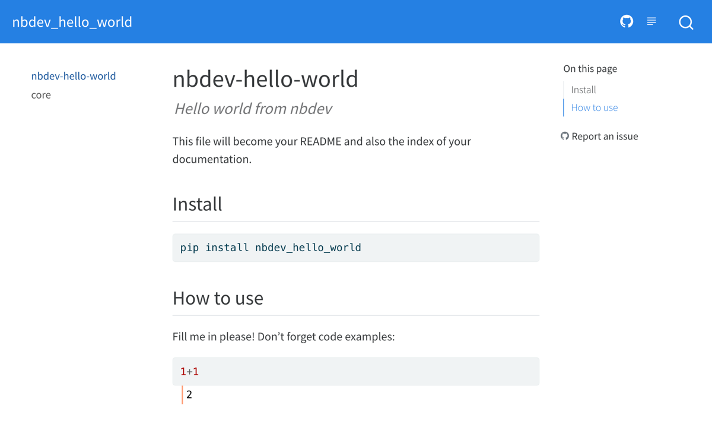
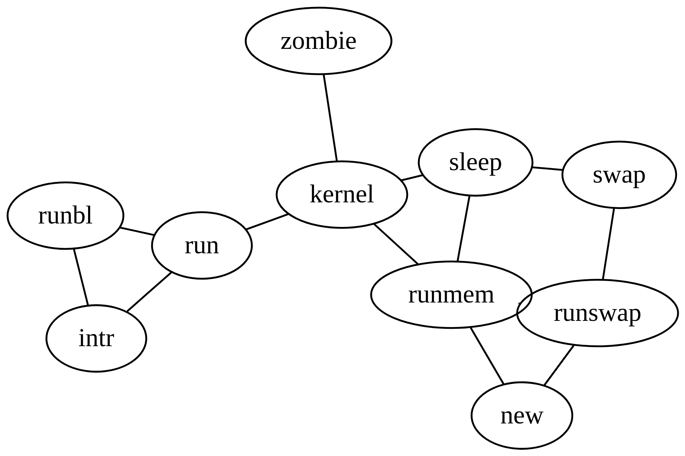

# End-To-End Walkthrough


<!-- WARNING: THIS FILE WAS AUTOGENERATED! DO NOT EDIT! -->

The written tutorial below shows you how to create a Python package from
scratch using nbdev.

Alternatively, you can watch this video tutorial where Jeremy Howard and
Hamel Husain guide you through a similar process step by step:

<div class="text-center">

<iframe width="560" height="315" src="https://www.youtube-nocookie.com/embed/l7zS8Ld4_iA" frameborder="0" allow="accelerometer; autoplay; encrypted-media; gyroscope; picture-in-picture" allowfullscreen style="max-width: 100%; margin: auto" class="rounded">

</iframe>

</div>

## Installation

You’ll need the following software to complete the tutorial, read on for
specific installation instructions:

1.  Python
2.  A Python package manager: we recommend conda or pip
3.  Jupyter Notebook
4.  nbdev
5.  Quarto

If you haven’t worked with Python before, we recommend getting started
with the [Anaconda Individual
Edition](https://www.anaconda.com/products/individual) and using the
conda package manager.

Note that you will only need to follow the steps in the installation
section once per environment. If you create a new repo, you won’t need
to redo these.

### Install JupyterLab

Launch a terminal and install JupyterLab by entering:

``` sh
conda install -c conda-forge -y jupyterlab
```

…or

``` sh
pip install jupyterlab
```

…if you’re using the pip package manager.

You can now launch Jupyter by entering:

``` sh
jupyter lab
```

This should open JupyterLab in a new browser tab:


### Install nbdev

The next step is to install nbdev itself. JupyterLab comes with its own
terminal, so we’ll use that moving forward.

In the Launcher, scroll down to the “Other” section, then click
“Terminal”. If the Launcher isn’t opened, you can open it by clicking
“File” → “New Launcher”.

A new tab should open with a blank terminal – it might not look exactly
the same, depending on how your shell is configured:


For Mac and Linux, enter:

``` sh
conda install -c fastai -y nbdev
```

…or for Mac, Linux and Windows:

``` sh
pip install nbdev
```

…if you’re using pip.

### Install Quarto

nbdev provides a command to install the latest version of Quarto. In the
terminal, enter:

``` sh
nbdev_install_quarto
```

Your password may be requested at this point. Since nbdev is open
source, you can read [the source
code](https://github.com/fastai/nbdev/blob/master/nbdev/quarto.py) of
this command to verify that it isn’t doing anything malicious. Or, if
you prefer, you may instead follow [Quarto’s official installation
instructions](https://quarto.org/docs/get-started/).

### Install Quarto JupyterLab extension

Quarto provides its own [JupyterLab
extension](https://quarto.org/docs/tools/jupyter-lab-extension.html)
that allows it to render Quarto markdown content.

For example, here is their notebook demonstrating some of its features:


Install the extension by entering:

``` sh
pip install jupyterlab-quarto
```

Note that the `jupyterlab-quarto` package is not currently available via
conda.

------------------------------------------------------------------------

You’re all setup and ready to go! Installing these tools may take some
time, but you’ll only need to do it once. Next, we’ll setup an nbdev
repo for your specific project.

## First steps

By the end of this section you’ll have your own nbdev repo with tests,
continuous integration, streamlined PyPI & conda packaging, and a
documentation website.

### Create an empty GitHub repo

Create an empty GitHub repo using the convenient link
[github.com/new](https://github.com/new). If you get stuck, you might
find GitHub’s [*Create a
repo*](https://docs.github.com/en/get-started/quickstart/create-a-repo)
page helpful.

Remember to add a description, since nbdev will use that later. Don’t
add a README file, .gitignore, or license just yet.

If you’re using the web interface, it should look something like this
(with your own repository name and description) before you click “Create
Repository”:


You should then be redirected to your new repo:


<div>

> **Try GitHub’s powerful CLI**
>
> GitHub’s web interface is a great way to get started. As you grow more
> experienced, you might want to explore [the GitHub
> CLI](https://github.com/cli/cli) (command line interface). We often
> prefer to use command line tools for repetitive tasks where we’re
> likely to make mistakes. Having those tasks written as small scripts
> in your terminal means that you can repeat them with little effort.

</div>

### Initialise your repo with nbdev

Now clone your repo from the Jupyter terminal you started
[earlier](#install-nbdev) (or create a new terminal following those
instructions if needed). If you get stuck here, you might find GitHub’s
[*Cloning a
repository*](https://docs.github.com/en/repositories/creating-and-managing-repositories/cloning-a-repository)
page helpful.

Since we created a repo named `nbdev-hello-world` with the `fastai`
user, we can clone it as follows:

``` sh
git clone https://github.com/fastai/nbdev-hello-world.git
```

Then `cd` (change directory) to our repo:

``` sh
cd nbdev-hello-world
```

You may have seen this message while cloning:

    You appear to have cloned an empty repository.

…since the repo is completely empty. Let’s add some files!

nbdev provides the
[`nbdev_new`](https://nbdev.fast.ai/api/cli.html#nbdev_new) command to
initialise an empty git repository. It’ll infer information about your
project from git and GitHub, and ask you to input anything remaining. It
will create files in your repo that:

- Streamline publishing Python packages to PyPI and conda.
- Configure Quarto for publication-grade technical documentation.
- Setup GitHub actions to test notebooks and build and deploy Quarto
  docs to GitHub pages.

Initialise your nbdev repo by entering:

``` sh
nbdev_new
```

It may ask you to enter information that it couldn’t infer from git or
GitHub.

<div>

> **Note**
>
> [`nbdev_new`](https://nbdev.fast.ai/api/cli.html#nbdev_new) assumes
> that your package name is the same as your repo name (with `-`
> replaced by `_`). Use the `--lib_name` option if that isn’t the case.

</div>

Double-check your `settings.ini` file to ensure that it has all of the
correct information. Then commit and push your additions to GitHub:

``` sh
git add .
git commit -m'Initial commit'
git push
```

### Enable GitHub Pages

nbdev hosts your docs on GitHub Pages—an excellent (and free!) way to
host websites.

<div>

> **Note**
>
> nbdev uses GitHub Pages by default because its easily accessible.
> However, you can use any host you like. See [these
> docs](../explanations/docs.ipynb#deploying-your-docs-on-other-platforms)
> for more information.

</div>

You need to enable GitHub Pages for your repo by clicking on the
“Settings” tab near the top-right of your repo page, then “Pages” on the
left, then setting the “Branch” to “gh-pages”, and finally clicking
“Save”.

It should look similar to this after you click “Save”:


If you don’t see a “gh-pages” branch, wait a few minutes and reload the
page. It should automatically be set up for you.

Now it’s time to see all of the goodies nbdev gives you!

### Check out your workflows

Open GitHub Actions by clicking the “Actions” tab near the top of your
repo page. You should see two workflow runs:



If you opened this page shortly after pushing your initial commit, the
runs may not have a green check (✅) because they’re still “In progress”
or “Queued”. That’s no problem, they shouldn’t take much more than a
minute to complete.

If you see a red cross (❌), that means something failed. Click on the
cross, then click “Details”, and you’ll be able to see what failed. If
you can’t figure out what’s wrong, search [the
forum](https://forums.fast.ai/c/nbdev/48) in case someone else resolved
the same issue, otherwise create a new post describing your issue in as
much detail as you can, and we’ll try our best to help you. Remember
that including a link to an actual repo and/or GitHub Action is the best
way for us to quickly identify what’s wrong.

What do these workflows do?

- **CI** – The CI (continuous integration) workflow streamlines your
  developer workflow, particularly with multiple collaborators. Every
  time you push to GitHub, it ensures that:
  - Your notebooks and libraries are in sync
  - Your notebooks are cleaned of unwanted metadata (which pollute pull
    requests and git histories and lead to merge conflicts)
  - Your notebook tests all pass
- **Deploy to GitHub Pages** – Builds your docs with Quarto and deploys
  it to GitHub Pages.

We provide these basic workflows out-of-the-box, however, you can edit
their corresponding YAML files in the `.github/workflows/` folder to
your liking.

### Check out your docs

When you [enable GitHub Pages](#enable-github-pages) you should see a
new workflow run: “pages build and deployment”. As the name suggests,
this workflow deploys your website contents to GitHub Pages.


Wait for the workflow run to complete, then open your website. By
default it should be available at: `https://{user}.github.io/{repo}`.
For example, you can view `fastai`’s `nbdev-hello-world` docs at
<https://fastai.github.io/nbdev-hello-world>.



### Recap

You now have a base nbdev repo with continuous integration and hosted
documentation! Here’s a recap of the steps you took:

- Created a GitHub repo (with GitHub Pages enabled)
- Initialised your repo with
  [`nbdev_new`](https://nbdev.fast.ai/api/cli.html#nbdev_new)
- Pushed to GitHub.

## Make your first edit

In this section, you’ll make your first edit to the repo you created in
[*First steps*](#first-steps).

### Install hooks for git-friendly notebooks

Step one when working with Jupyter notebooks in a new repo is to install
nbdev’s hooks (you can think of “hooks” as plugins or extensions to an
application).

Install them by entering this command in your terminal:

``` sh
nbdev_install_hooks
```

<div>

> **Note**
>
> The [clean hook](#nbdev_clean-on-saving-notebooks-in-jupyter)
> currently only supports Jupyter Notebook and JupyterLab. If you’re
> using VSCode, you can try the [experimental nbdev VSCode
> extension](https://github.com/fastai/nbdev-vscode). Otherwise, you
> might also want to try [nbdev’s pre-commit
> hooks](../tutorials/pre_commit.ipynb).

</div>

See [*Git-friendly Jupyter*](git_friendly_jupyter.html) for more about
how nbdev hooks work and how to customise them. Here’s a short summary:

- Fix broken notebooks due to git merge conflicts so that they can be
  opened and resolved directly in Jupyter.
- Each time you save a Jupyter notebook, automatically clean unwanted
  metadata to remove unnecessary changes in pull requests and reduce the
  chance of git merge conflicts.
- Automatically trust notebooks in the repo so that you can view widgets
  from collaborators’ commits. For this reason, **you should not install
  hooks into a repo you don’t trust**.

<div>

> **Tip**
>
> nbdev’s git hooks work on *any* git repo, even if it doesn’t use the
> broader nbdev system.

</div>

### Build your library

You should now create your package from your notebook by running:

``` sh
nbdev_export
```

This will create Python modules for your notebooks. These modules will
make up the contents of your Python package.

### Install your package

You might have noticed that
[`nbdev_new`](https://nbdev.fast.ai/api/cli.html#nbdev_new) created a
Python package in your repo. In our case, it was automatically named
`nbdev_hello_world` by using our repo name `nbdev-hello-world` and
replacing `-` with `_` to make it a valid Python package.

The next step is to install your package by entering this into your
terminal:

``` sh
pip install -e '.[dev]'
```

This is the recommended way to make a Python package importable from
anywhere in your current environment:

- `-e` – short for “editable”, lets you immediately use changes made to
  your package without having to reinstall, which is convenient for
  development.
- `.` – refers to the current directory.
- `[dev]` – includes “development” requirements: other packages that
  your notebooks use solely for documentation or testing.

### Preview your docs

nbdev is an interactive programming environment that values fast
feedback loops. The
[`nbdev_preview`](https://nbdev.fast.ai/api/quarto.html#nbdev_preview)
command helps achieve this by using Quarto to render your docs on your
computer and keep them updated as your edit your notebooks.

Start the preview by entering this into your terminal:

``` sh
nbdev_preview
```

It may say `Preparing to preview` for a few seconds while it gets
started, and will eventually display something like:

    Watching files for changes
    Browse at http://localhost:3000/

Click the link to open the preview in a new browser tab. It should look
exactly like your online docs.

<div>

> **Tip**
>
> We often find it useful to keep a preview window open on the side
> while we’re editing our notebooks in Jupyter.

</div>

### Edit 00_core.ipynb

Now, open the `nbs/00_core.ipynb` file (generated by running
[`nbdev_new`](https://nbdev.fast.ai/api/cli.html#nbdev_new) earlier) in
Jupyter. You don’t *have* to start your notebook names with a number,
but we find it helpful to show the order that your project should be
read in – even though it could have been created in a different order.

#### Add your own frontmatter

You’ll see something that looks a bit like this:

<div class="py-2 px-3 mb-4 border rounded shadow-sm" fig-align="center">

**core**

> Fill in a module description here

``` python
#| default_exp core
```

</div>

Let’s explain what these special cells means:

- The first is a markdown cell with nbdev’s markdown *frontmatter*
  syntax that defines notebook metadata used by Quarto, our
  documentation engine (see the
  [frontmatter](../api/09_frontmatter.ipynb) reference page for more).
  It contains:
  - H1 header (“core”) – defining the page title
  - Quote (“Fill in a module description here”) – defining the page
    description
- The second is a code cell with a *directive* `default_exp` which
  decides which module this notebook will export to (see the
  [Directives](../explanations/directives.ipynb) explanation for more).
  Currently, it exports to the `core` module.

Next, rename the notebook, replace the title and description, and change
the default export module for your own project.

Once you’re done, save the notebook. The live preview started in the
previous section should update with your latest changes.

Rerun all cells in your notebook to ensure that they work, and to export
the updated modules.

<div>

> **Tip**
>
> We find the “restart kernel and run all cells” Jupyter command (the ⏩
> button) so invaluable that we bind it to a keyboard shortcut. A common
> criticism of notebooks is that out-of-order execution leads to
> irreproducible notebooks. In our experience, making “restart and
> rerun” a habit solves this problem.

</div>

Running the notebook exports Python modules because of the last cell
which contains:

``` python
#| hide
import nbdev; nbdev.nbdev_export()
```

What does this mean?

- `#| hide` is a directive (like `#| default_exp`) which excludes a cell
  from both your exported module and docs
- [`nbdev_export`](https://nbdev.fast.ai/api/doclinks.html#nbdev_export)
  is the command used to export your notebooks to Python modules.

We recommend including a cell like this at the bottom of all of the
notebooks you want to export.

<div>

> **Warning**
>
> Remember to delete any unused modules that aren’t exported by a
> notebook or otherwise needed by your package. This is likely to happen
> if you change the default export of a notebook – nbdev doesn’t remove
> the old module. This is intended, since nbdev is designed to work with
> hybrid packages that use .py modules (with no corresponding notebook)
> as well as those exported from notebooks.

</div>

#### Add your own function

Add a new code cell below the `#| default_exp` cell with a function. For
example:

``` python
#| export
def say_hello(to):
    "Say hello to somebody"
    return f'Hello {to}!'
```

Notice how it includes `#| export` at the top – this is a directive
(like `#| default_exp`) that tells nbdev to include the cell in your
exported module and in your documentation.

The documentation should look like this:

<div class="py-2 px-3 mb-4 border rounded shadow-sm">

------------------------------------------------------------------------

### say_hello

>  say_hello (to)

Say hello to somebody

</div>

#### Add your own examples, tests, and docs

One of the superpowers of notebook-driven development is that you can
very easily add examples, tests, and documentation right below your
code.

Include regular code cells, and they’ll appear (with output) in your
docs, for example:

``` python
say_hello("Isaac")
```

    'Hello Isaac!'

This is a test too! When you run
[`nbdev_test`](https://nbdev.fast.ai/api/test.html#nbdev_test) it will
execute this cell (and all other test cells) and fail if they raise any
exceptions.

For tests, it’s preferred to use more explicit `assert`s:

``` python
assert say_hello("Hamel") == "Hello Hamel!"
```

…or functions from
[`fastcore.test`](https://fastcore.fast.ai/test.html), which behave like
`assert` but also display the actual and expected values if they differ:

``` python
from fastcore.test import *
```

``` python
test_eq(say_hello("Hamel"), "Hello Hamel!")
```

Another superpower of notebook-driven development is that your examples
can include plots, images, and even JavaScript widgets. For example,
here’s an SVG circle:

``` python
from IPython.display import display,SVG
```

``` python
display(SVG('<svg height="100" xmlns="http://www.w3.org/2000/svg"><circle cx="50" cy="50" r="40"/></svg>'))
```


### Prepare your changes

Before commiting your changes to GitHub we recommend running
`nbdev_prepare` in the terminal, which bundles the following commands:

- [`nbdev_export`](https://nbdev.fast.ai/api/doclinks.html#nbdev_export):
  Builds the `.py` modules from Jupyter notebooks
- [`nbdev_test`](https://nbdev.fast.ai/api/test.html#nbdev_test): Tests
  your notebooks
- [`nbdev_clean`](https://nbdev.fast.ai/api/clean.html#nbdev_clean):
  Cleans your notebooks to get rid of extreanous output for git
- [`nbdev_readme`](https://nbdev.fast.ai/api/quarto.html#nbdev_readme):
  Updates your repo’s `README.md` file from your index notebook.

### Edit index.ipynb

Now you’re ready to personalize your documentation home page and
`README.md` file; these are both generated automatically from
index.ipynb. Open Jupyter, then click on `nbs/index.ipynb` to open it.

We recommend including a longer description about what your package
does, how to install it, and how to use it (with a few examples which
import and use your package). Remember, examples can be code cells with
real outputs rather than plain markdown text – they’ll double as tests
too!

### Push to Github

You can now commit and push your changes to GitHub. As we mentioned
before, always remember to run `nbdev_prepare` before you commit to
ensure your modules are exported and your tests pass. You can use
`git status` to check which files have been generated or changed. Then:

``` sh
git add .
git commit -m 'Add `say_hello`; update index' # Update this text with your own message
git push
```

This will kick-off your GitHub Actions. Wait a minute or two for those
to complete, then check your updated repo and documentation.

### Recap

Congratulations, you’ve used all of the basics needed to build
delightful projects with nbdev! Here’s a recap of the steps you took:

- Installed hooks for git-friendly notebooks with
  [`nbdev_install_hooks`](https://nbdev.fast.ai/api/clean.html#nbdev_install_hooks)
- Installed your package with `pip install -e '.[dev]'`
- Previewed your docs with
  [`nbdev_preview`](https://nbdev.fast.ai/api/quarto.html#nbdev_preview)
- Added your own frontmatter, function, tests, and docs to
  `nbs/00_core.ipynb`
- Prepared your changes with `nbdev_prepare`
- Updated `nbs/index.ipynb` with your own information
- Pushed to GitHub.

Read on to learn about more advanced nbdev functionality. Also see our
[explanations](../explanations) for deep-dives on specific topics, as
well as our other [tutorials](../tutorials).

## Advanced functionality

### Add a class

Create a class in `00_core.ipynb` as follows:

``` python
#| export
class HelloSayer:
    "Say hello to `to` using `say_hello`"
    def __init__(self, to): self.to = to
        
    def say(self):
        "Do the saying"
        return say_hello(self.to)
```

This will automatically appear in the docs like this:

------------------------------------------------------------------------

### HelloSayer

>  HelloSayer (to)

*Say hello to `to` using `say_hello`*

#### Document with show_doc

However, methods aren’t automatically documented. To add method docs,
use [`show_doc`](https://nbdev.fast.ai/api/showdoc.html#show_doc):

``` python
show_doc(HelloSayer.say)
```

------------------------------------------------------------------------

### HelloSayer.say

>  HelloSayer.say ()

*Do the saying*

And add some examples and/or tests:

``` python
o = HelloSayer("Alexis")
o.say()
```

    'Hello Alexis!'

### Add links with backticks

Notice above there is a link from our new class documentation to our
function. That’s because we used backticks in the docstring:

``` python
    "Say hello to `to` using `say_hello`"
```

These are automatically converted to hyperlinks wherever possible. For
instance, here are hyperlinks to `HelloSayer` and `say_hello` created
using backticks.

### Set up autoreload

Since you’ll be often updating your modules from one notebook, and using
them in another, it’s helpful if your notebook automatically reads in
the new modules as soon as the Python file changes. To make this happen,
just add these lines to the top of your notebook:

    %load_ext autoreload
    %autoreload 2

### Set up prerequisites

If your module requires other modules as dependencies, you can add those
prerequisites to your `settings.ini` in the `requirements` section. The
requirements should be separated by a space and if the module requires
at least or at most a specific version of the requirement this may be
specified here, too.

For example if your module requires the `fastcore` module of at least
version 1.0.5, the `torchvision` module of at most version 0.7 and any
version of `matplotlib`, then the prerequisites would look like this:

``` python
requirements = fastcore>=1.0.5 torchvision<0.7 matplotlib
```

In addition to `requirements` you can specify dependencies with other
keywords that have different scopes. Below is a list of all possible
dependency keywords:

- `requirements`: Passed to both pip and conda setup
- `pip_requirements`: Passed to pip setup only
- `conda_requirements`: Passed to conda setup only
- `dev_requirements`: Passed to pip setup as a development requirement

For more information about the format of dependencies, see the pypi and
conda docs on creating specifications in
[setup.py](https://packaging.python.org/tutorials/packaging-projects/#creating-setup-py)
and
[meta.yaml](https://docs.conda.io/projects/conda-build/en/latest/resources/define-metadata.html),
respectively.

### Set up console scripts

Behind the scenes, nbdev uses that standard package `setuptools` for
handling installation of modules. One very useful feature of
`setuptools` is that it can automatically create [cross-platform console
scripts](https://python-packaging.readthedocs.io/en/latest/command-line-scripts.html#the-console-scripts-entry-point).
nbdev surfaces this functionality; to use it, use the same format as
`setuptools`, with whitespace between each script definition (if you
have more than one).

    console_scripts = nbdev_export=nbdev.cli:nbdev_export

### Upload to pypi

If you want people to be able to install your project by just typing
`pip install your-project` then you need to upload it to
[pypi](https://pypi.org/). The good news is, we’ve already created a
fully pypi compliant installer for your project! So all you need to do
is register at pypi (click “Register” on pypi) if you haven’t previously
done so, generate an API token (go to [Account
settings](https://pypi.org/manage/account/) and click “Add API token”)
and then create a file called `~/.pypirc` with your token details. It
should have these contents:

    [pypi]
    username = __token__
    password = your_pypi_token

Another thing you will need is `twine`, so you should run once

    pip install twine

To upload your project to pypi, just type `nbdev_pypi` in your project
root directory. Once it’s complete, a link to your project on pypi is
displayed.

### Upload to conda

Similar to `pip install` support, we have provided an anaconda compliant
installer to upload your project to [anaconda](https://anaconda.org).
Once uploaded, your package can be installed by typing
`conda install -c your_anaconda_username your-project`.

You need to register at anaconda (fill out the form to `Sign Up`) which
will create a username and password. You will then need to install the
following packages

    pip install anaconda-client conda-build conda-verify

Before running the anaconda uploader, you need to login to conda using
the CLI command (you will be prompted to enter your username and
password)

    anaconda login

To upload to anaconda, just type `nbdev_conda` in your project root
directory.

### Upload to pypi and conda

The command `nbdev_release_both` from the root of your nbdev repo will
upload your project to both conda and pypi.

### Install collapsible headings and toc2

There are two jupyter notebook extensions that I highly recommend when
working with projects like this. They are:

- [Collapsible
  headings](https://jupyter-contrib-nbextensions.readthedocs.io/en/latest/nbextensions/collapsible_headings/readme.html):
  This lets you fold and unfold each section in your notebook, based on
  its markdown headings. You can also hit <kbd>left</kbd> to go to the
  start of a section, and <kbd>right</kbd> to go to the end
- [TOC2](https://jupyter-contrib-nbextensions.readthedocs.io/en/latest/nbextensions/toc2/README.html):
  This adds a table of contents to your notebooks, which you can
  navigate either with the `Navigate` menu item it adds to your
  notebooks, or the TOC sidebar it adds. These can be modified and/or
  hidden using its settings.

### Math equation support

nbdev supports equations (using [Quarto](https://quarto.org/)). You can
include math in your notebook’s documentation using the following
methods.

Using `$$`, e.g.:

    \sum_{i=1}^{k+1}i

Which is rendered as:

> \_{i=1}^{k+1}i

Using `$`, e.g.:

    This version is displayed inline: \sum_{i=1}^{k+1}i . You can include text before and after.

Which is rendered as:

> This version is displayed inline: \_{i=1}^{k+1}i . You can include
> text before and after.

For more information, see [the Quarto
Docs](https://quarto.org/docs/visual-editor/technical.html)

### Look at nbdev “source” for more ideas

Don’t forget that nbdev itself is written in nbdev! It’s a good place to
look to see how fast.ai uses it in practice, and get a few tips. You’ll
find the nbdev notebooks here in the [nbs
folder](https://github.com/fastai/nbdev/tree/master/nbs) on Github.

### Quarto Features

nbdev supports most Quarto features. We encourage you to read the
[Quarto documentation](https://quarto.org/) to discover all the features
available to you. For example, this is how you can [incorporate
Graphviz](https://quarto.org/docs/authoring/diagrams.html#graphviz):

<div>

<figure class=''>

<div>



</div>

</figure>

</div>

It is worth taking a look at the documentation for
[figures](https://quarto.org/docs/authoring/figures.html),
[callouts](https://quarto.org/docs/authoring/callouts.html),
[markdown](https://quarto.org/docs/authoring/markdown-basics.html),
[widgets](https://quarto.org/docs/interactive/widgets/jupyter.html),
[layouts](https://quarto.org/docs/interactive/layout.html), [conditional
content](https://quarto.org/docs/authoring/conditional.html) and [quarto
extensions](https://quarto.org/docs/extensions/) to name a few useful
things we have encountered.
